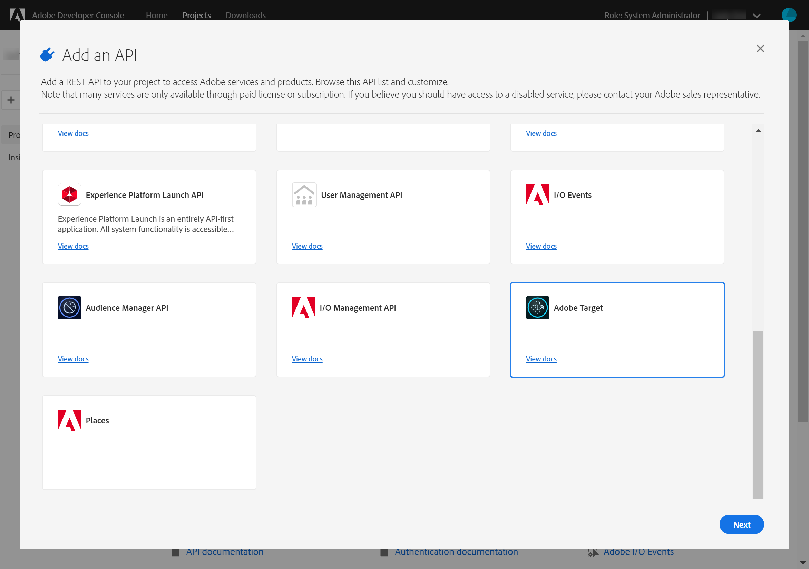
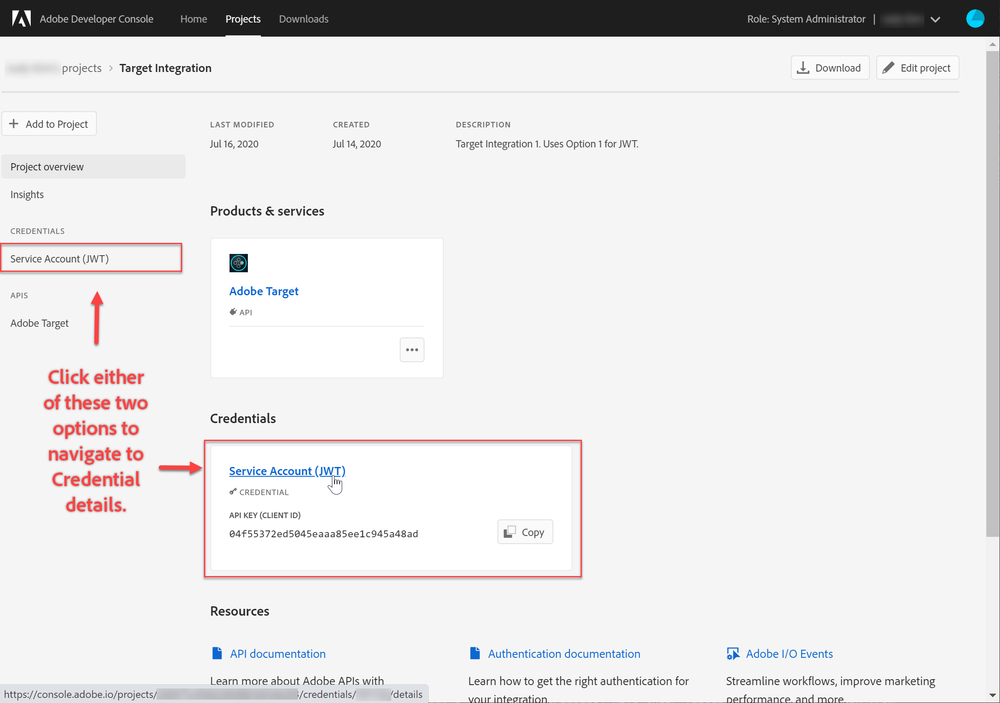
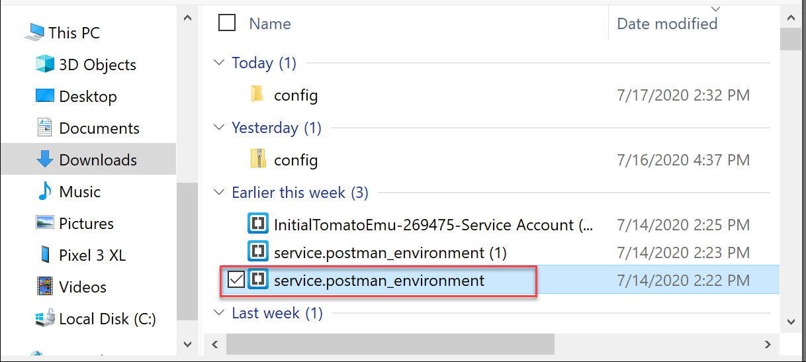
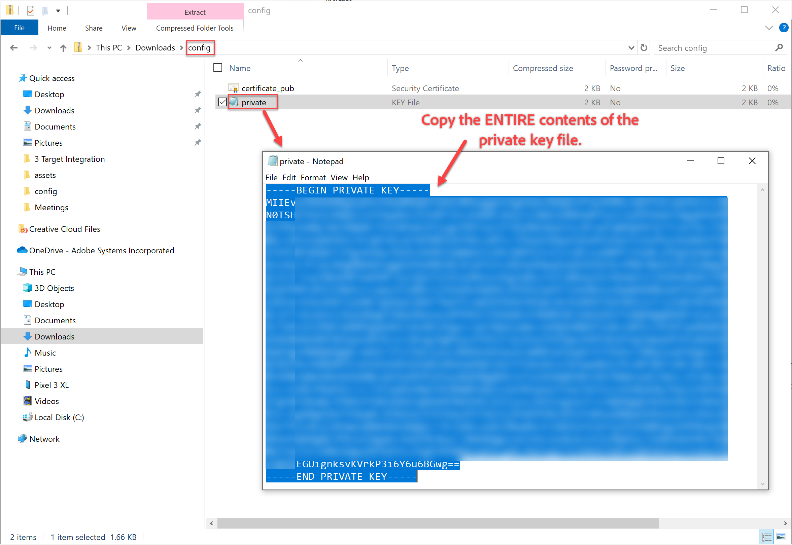
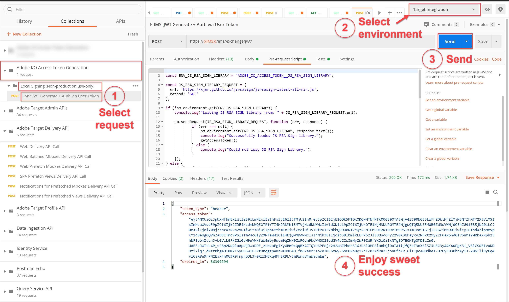

# Konfigurera autentisering

Adobe Target Admin API:er, inklusive [!DNL Recommendations] Admin API:er, skyddas av autentisering så att endast behöriga användare kan använda dem för att få åtkomst till Adobe Target. Använd [Adobe Developer Console](https://console.adobe.io/) för att hantera autentiseringen för alla Adobe Experience Cloud-lösningar, inklusive [!DNL Target].

I den här lektionen går vi igenom de preliminära steg som krävs för att generera autentiseringstoken som behövs för att kunna interagera med Adobe Target API:er. I följande avsnitt:

1. Skapa ett projekt (som tidigare kallades integration) på Adobe Developer Console.
2. Exportera projektinformation till Postman.
3. Generera en token för innehavaråtkomst.
4. Testa innehavaråtkomsttoken.

## Krav

| Resurs | Detaljer |
| --- | --- |
| Postman | För att kunna slutföra de här stegen måste du skaffa [Postman-appen](https://www.postman.com/downloads/) för ditt operativsystem. Postman Basic är kostnadsfritt när man skapar konto. Även om det inte krävs för att kunna använda Adobe Target API:er i allmänhet, underlättar Postman API-arbetsflödena, och Adobe Target tillhandahåller flera Postman-samlingar som hjälper till att köra API:erna och lära sig hur de fungerar. Resten av den här självstudiekursen förutsätter att Postman har praktiska kunskaper. Om du behöver hjälp kan du läsa [Postmans dokumentation](https://learning.getpostman.com/). |
| Referenser | Du bör känna till följande resurser under resten av kursen:<UL><li>[Adobe I/O Github](https://github.com/adobeio)</li><li>[Adobe I/O-dokumentation](https://developers.adobetarget.com/api/#introduction)</li><li>[Recommendations API-dokumentation](https://developers.adobetarget.com/api/recommendations/)</li></ul> |

## Skapa ett I/O-projekt för Adobe

I det här avsnittet öppnar du Adobe Developer Console och skapar ett projekt för [!DNL Adobe Target]. Mer information finns i [projektdokumentationen](https://www.adobe.io/apis/experienceplatform/console/docs.html#!AdobeDocs/adobeio-console/master/projects.md).

<!--1. Generate your private key and public certificate, per the [documentation on authentication](https://www.adobe.io/authentication/auth-methods.html#!AdobeDocs/adobeio-auth/master/JWT/JWTCertificate.md). //<!--as described in **Step 1** of [How to set up Adobe IO: Authentication - Step by Step](https://helpx.adobe.com/marketing-cloud-core/kb/adobe-io-authentication-step-by-step.html). After completing Step 1, return to this tutorial and resume with Step 2, below. // The outcome of this step should be the creation of a `private.key` file and a `certificate_pub.crt` file. Return to this tutorial once you have generated these two files.-->

1. I [Adobe Admin Console](https://adminconsole.adobe.com/)ser du till att ditt användarkonto i Adobe har beviljats åtkomst på både [produktadministratörsnivå](https://helpx.adobe.com/enterprise/using/admin-roles.html) och [utvecklarnivå](https://helpx.adobe.com/enterprise/using/manage-developers.html) till [!DNL Target].

2. I [Adobe Developer Console](https://console.adobe.io/)väljer du den Experience Cloud-organisation som du vill skapa den här integreringen för. (Observera att du förmodligen bara har tillgång till en enda organisation i Experience Cloud.)

   

3. Klicka på **[!UICONTROL Create new project]**.

   

4. Klicka **[!UICONTROL Add API]** för att lägga till ett REST API i ditt projekt för att få tillgång till tjänster och produkter från Adobe.

   

5. Välj **[!DNL Adobe Target]** den Adobe-tjänst du vill integrera med. Klicka på den **[!UICONTROL Next]** knapp som visas.

   

6. Välj ett alternativ för att associera offentliga och privata nycklar med den tjänstkontointegration du skapar för Target. I den här självstudiekursen väljer du **[!UICONTROL Option 1: Generate a key pair]** och klickar **[!UICONTROL Generate keypair]**.
   

7. Lägg märke till resultatet! Anteckna den automatiskt hämtade konfigurationsfilen (`config`) som innehåller din privata nyckel. Klicka på **[!UICONTROL Next]**.
   
8. Kontrollera platsen för `config`, som är den komprimerade konfigurationsfilen som skapades i föregående steg, i filsystemet. Återigen innehåller den här `config` filen din privata nyckel, som du behöver senare. Den exakta platsen i filsystemet kan skilja sig från den som visas här.
   
9. Gå tillbaka till Adobe Developer Console och markera de [produktprofiler](https://helpx.adobe.com/enterprise/using/manage-products-and-profiles.html) som motsvarar de egenskaper som du använder [!DNL Recommendations]. (Om du inte använder egenskaper markerar du alternativet Standardarbetsyta.) Klicka på **[!UICONTROL Save configured API]**.
   

10. Klicka på **[!UICONTROL Create Integration]**. Du bör få ett tillfälligt meddelande om att ditt API har konfigurerats.

11. Som ett sista steg byter du namn på projektet till ett namn som är mer meningsfullt än det ursprungliga `Project 1`. Det gör du genom att navigera till projektet med den navigeringssökväg som visas, klicka **[!UICONTROL Edit project]** för att komma åt den spärrade **[!UICONTROL Edit Project] och byta namn på projektet.

>[!NOTE]
> 
>I den här självstudiekursen kallar vi projektet&quot;Målintegrering&quot;. Om du tänker använda ditt projekt för mer än bara Adobe Target kanske du vill namnge det därefter. Du kan till exempel välja att ge den namnet&quot;Adobe API:er&quot; eller&quot;Experience Cloud API:er&quot;, eftersom den kan användas med andra lösningar i Adobe Experience Cloud.

## Exportera projektinformation

Nu när du har ett Adobe-projekt som du kan använda för åtkomst [!DNL Target]måste du se till att skicka information om det projektet tillsammans med dina Adobe API-begäranden. Dessa uppgifter krävs för att interagera med flera Adobe-API:er, inklusive flera [!DNL Target] API:er. Integreringsinformationen innehåller till exempel autentiserings- och autentiseringsinformation som krävs av API:erna för [!DNL Target] administratörer. Om du vill använda API:erna med Postman måste du därför hämta informationen till Postman.

Det finns många sätt att specificera projektdetaljer i Postman, men i det här avsnittet utnyttjar vi vissa färdiga funktioner och samlingar. Först (i det här avsnittet) exporteras detaljerna om din integrering till en Postman-miljö. Därefter (i följande avsnitt) genererar du en token för innehavaråtkomst som ger dig tillgång till de nödvändiga Adobe-resurserna.

>[!NOTE]
>
>Instruktioner om hur du använder Experience Cloud finns i [!DNL Target]Use Postman with Experience Platform API:er . Följande avsnitt är relevanta för [!DNL Target] API:erna:
>
> 1. Exportera integreringsinformation för Adobe i/O till Postman
> 2. Generera en åtkomsttoken med Postman

>
> 
Dessa steg finns också nedan.

1. Gå till [Adobe Developer Console](https://console.adobe.io/)och visa det nya projektets **[!UICONTROL Service Account (JWT)]** autentiseringsuppgifter. Använd antingen den vänstra navigeringen eller det **[!UICONTROL Credentials]** avsnitt som visas.
   In **[!UICONTROL Credential details]**, observera att du kan visa dina **offentliga nycklar**, **klient-ID**och annan information som rör ditt tjänstkonto.
   
2. Klicka för att navigera till information om **[!UICONTROL Adobe Target]** API:t. Använd antingen den vänstra navigeringen eller det **[!UICONTROL Connected products and services]** avsnitt som visas.
   
3. Klicka **[!UICONTROL Download for Postman]** > **[!UICONTROL Service Account (JWT)]** för att skapa en JSON-fil som hämtar din autentiseringsinformation för en Postman-miljö.
   Anteckna JSON-filen i filsystemet.
   
4. I Postman klickar du på kugghjulsikonen för att hantera dina miljöer och sedan på **Importera** för att importera JSON-filen (miljö).
   
5. Välj filen och klicka på **Öppna**.
   
6. Klicka på namnet på den nyligen importerade miljön på Postman **Manage Environment** modal för att inspektera den. (Ditt miljönamn kan skilja sig från det som visas här. Redigera namnet efter behov. Det behöver inte nödvändigtvis matcha namnet på Adobe-projektet.)
   
7. Observera att värdena `CLIENT_SECRET` och `API_KEY` (tillsammans med andra variabler) är förifyllda, tagna från din integrering enligt definitionen i Adobe Developer Console. (Postman- `CLIENT_SECRET` variabeln ska matcha de `CLIENT SECRET` Adobe-autentiseringsuppgifter som visas i Developer Console, och `API_KEY` i Postman ska likaså matcha dem `CLIENT ID` i Developer Console.) Observera, `PRIVATE_KEY`och `JWT_TOKEN``ACCESS_TOKEN` är tomma. Låt oss börja med att ange `PRIVATE_KEY` värdet.
   

   >[!NOTE]
   >
   >**Överraskning!**
   >
   >Pop quiz! Minns du var din privata nyckel är?
   >Det stämmer, det finns i den fil som du laddade ned tidigare från Adobe Developer Console! `config`

8. Öppna `config` filen från filsystemet och öppna `private` nyckelfilen.
   
9. Markera och kopiera hela innehållet i `private` nyckelfilen.
   
10. I Postman klistrar du in värdet för den privata nyckeln i fälten **INITIALVÄRDE** och **AKTUELLT VÄRDE** .
   
11. Klicka **[!UICONTROL Update]** och stäng Miljöerna modal.

## Generera token för innehavaråtkomst

I det här avsnittet genererar du en token för innehavaråtkomst som krävs för att autentisera din interaktion med Adobe Target API:er. Om du vill generera en token för innehavaråtkomst måste du skicka integreringsinformationen (som anges i de föregående avsnitten) till [Adobe Identity Management-tjänsten (IMS)](https://www.adobe.io/authentication/auth-methods.html#!AdobeDocs/adobeio-auth/master/AuthenticationOverview/AuthenticationGuide.md). Det finns flera olika sätt att göra detta, men i den här självstudiekursen har du skapat en skräddarsydd begäran om POST till IMS API. Skämtar bara. I den här självstudiekursen använder vi en Postman-samling med ett färdigbyggt IMS-anrop som gör processen direkt och enkel. När du har importerat samlingen kan du återanvända den när det behövs för att generera nya tokens inte bara för Adobe Target, utan även för andra Adobe-API:er.

1. Navigera till [Adobe Identity Management Service API-exempelanrop](https://github.com/adobe/experience-platform-postman-samples/tree/master/apis/ims).
   
2. Klicka på samlingen **Adobe i Token Generation Postman för**I/O-åtkomst.
   
3. Hämta rå-JSON för den här samlingen genom att klicka på **Raw**och sedan kopiera den resulterande JSON-filen till Urklipp. (Du kan också spara raw-JSON som en .json-fil.)
   
4. I Postman importerar du samlingen genom att klistra in och skicka rå JSON från Urklipp. (Du kan också överföra den .json-fil som du sparade.) Klicka på **Fortsätt**.
   
5. Markera **[!UICONTROL IMS: JWT Generate + Auth via User Token]** begäran i samlingen Adobe I/O Access Token Generation Postman, kontrollera att miljön är markerad och klicka på **Skicka** för att generera token.

   

   >[!NOTE]
   >
   >Denna innehavaråtkomsttoken gäller i 24 timmar. Skicka begäran igen när du behöver generera en ny token.

6. Öppna Hantera miljöer modal igen och välj din miljö.
   
7. Observera att värdena `ACCESS_TOKEN` och `JWT_TOKEN` nu är ifyllda.
   

>[!NOTE]
>
>F: Måste jag använda Adobe i/O Access Token Generation Postman-samlingen för att generera JSON Web Token (JWT) och innehavaråtkomsttoken?
>
>S: Nepp! Samlingen Adobe I/O Access Token Generation Postman är smidigare att generera JWT- och Bearer-åtkomsttoken i Postman. Du kan också använda funktionerna i Adobe Developer Console för att manuellt generera en token för innehavaråtkomst.

## Testa innehavaråtkomsttoken

I den här övningen använder du din nya innehavaråtkomsttoken genom att skicka en API-begäran som hämtar en lista över aktiviteter från ditt [!DNL Target] konto. Ett lyckat svar indikerar att ditt Adobe-projekt och din autentisering fungerar som förväntat för att kunna använda API:t.

1. Importera [Adobe Target Admin API:er Postman Collection](https://developers.adobetarget.com/api/#admin-postman-collection). Följ alla instruktioner tills samlingen importeras till Postman.
   
1. Expandera samlingen och notera **[!UICONTROL List activities]** begäran.
   
1. Observera att variabler som `{{access_token}}` till att börja med är olösta. Du kan lösa detta på flera olika sätt - du kan till exempel definiera en ny samlingsvariabel som kallas `{{access_token}}`- men i den här självstudiekursen ändrar du API-begäran så att den utnyttjar den Postman-miljö du använde tidigare. På så sätt kan miljön fortsätta att fungera som en enda, konsekvent konsolidering av alla variabler som är gemensamma för olika API:er i Adobe.
   
1. Skriv som ska ersättas `{{access_token}}` med `{{ACCESS_TOKEN}}`.
   
1. Skriv som ska ersättas `{{api_key}}` med `{{API_KEY}}`.
   
1. Skriv som ska ersättas `{{tenant}}` med `{{TENANT_ID}}`. Anteckningen `{{TENANT_ID}}` känns inte igen än.
   
1. Öppna modal Manage Environment (Hantera miljöer) och välj din miljö.
   
1. Skriv om du vill lägga till en ny `{{TENANT_ID}}` miljövariabel. Kopiera och klistra in ditt klient-ID-värde i fälten **INITIAL VALUE** och **CURRENT VALUE** för den nya `TENANT_ID` miljövariabeln.
   
   >[!NOTE]
   >
   >Klient-ID:t skiljer sig från ditt [!DNL Target]`clientcode`. Klient-ID:t finns i URL:en när du är inloggad på [!DNL Target]. Logga in på [!DNL Adobe Experience Cloud], öppna [!DNL Target]och klicka på [!DNL Target] kortet för att få ditt klient-ID. Använd det klient-ID som anges i URL-underdomänen.
   >
   >Om din URL-adress när du är inloggad på Adobe Target till exempel är
   ><https://mycompany.experiencecloud.adobe.com/...>
   >blir ditt klient-ID&quot;mincompany&quot;.

1. Skicka din begäran efter att du har valt rätt miljö. Du bör få ett svar med din lista över aktiviteter.
   

Grattis! Nu när du har verifierat autentiseringen i Adobe kan du använda den för att interagera med Adobe Target API:er (och andra Adobe API:er). Du kan till exempel [använda Recommendations API](https://docs.adobe.com/content/help/en/target-learn/recommendations-api-tutorial/recs-api-overview.html) för att skapa eller hantera rekommendationer.
