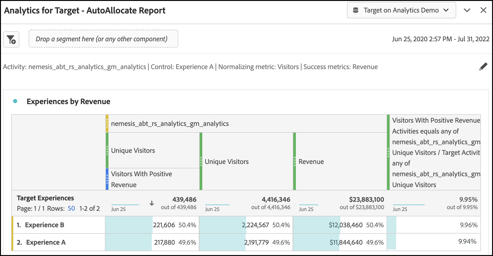

# Konfigurera A4T-rapporter i [!DNL Analysis Workspace] for [!DNL Auto-Allocate] verksamhet

An [!DNL Auto-Allocate] aktivitet identifierar en vinnare bland två eller fler upplevelser och omfördelar automatiskt mer trafik till vinnaren medan testet fortsätter att köras och lära sig. The [!UICONTROL Analytics for Target] (A4T)-integrering för [!UICONTROL Auto-Allocate] gör att du kan se dina rapportdata i [!DNL Adobe Analytics]och du kan även optimera för anpassade händelser eller mätvärden som definieras i [!DNL Analytics].

Även om det finns omfattande analysfunktioner i [!DNL Adobe Analytics] [!DNL Analysis Workspace], några ändringar av standardinställningen **[!UICONTROL Analytics for Target]** panel krävs för korrekt tolkning [!DNL Auto-Allocate] verksamhet på grund av nyanser i [optimeringskriterier](https://experienceleague.adobe.com/docs/target/using/integrate/a4t/a4t-at-aa.html?lang=en#supported).

I den här självstudiekursen går vi igenom de rekommenderade ändringarna för analys [!DNL Auto-Allocate] verksamhet i [!DNL Analysis Workspace]. De viktigaste begreppen är:

* [!UICONTROL Visitors] ska alltid användas som normaliseringsmått i [!DNL Auto-Allocate] verksamhet.
* När måttet är en [!DNL Adobe Analytics] mätvärdet beror den lämpliga täljaren för konverteringsgraden på vilken typ av optimeringsvillkor som valts under aktivitetsinställningarna.
   * Optimeringskriterierna&quot;maximera konverteringsgraden för unika besökare&quot; har en konverteringsgrad vars täljare är ett antal unika besökare med ett positivt värde av måttet.
   * &quot;maximize metric value per visitor* har en konverteringsgrad vars täljare är det reguljära måttvärdet i [!DNL Adobe Analytics]. Detta anges som standard i **[!UICONTROL Analytics for Target]** panel i [!DNL Analysis Workspace].
* När optimeringsmåttet är en [!DNL Target] definierat konverteringsmått, standardvärde **[!UICONTROL Analytics for Target]** panel i [!DNL Analysis Workspace] handtag som konfigurerar panelen.
* The [!UICONTROL Confidence] siffror i [!DNL Analysis Workspace] speglar inte [mer konservativ statistik som används av [!UICONTROL Auto-Allocate]](https://experienceleague.adobe.com/docs/target/using/activities/auto-allocate/automated-traffic-allocation.html?lang=en#section_98388996F0584E15BF3A99C57EEB7629)och ska tas bort.

## Skapa A4T för [!DNL Auto-Allocate] panel i [!DNL Analysis Workspace]

Skapa en A4T för [!DNL Auto-Allocate] rapporten börjar med **[!UICONTROL Analytics for Target]** panel i [!DNL Analysis Workspace], vilket visas nedan. Gör sedan följande val:

1. **[!UICONTROL Control Experience]**: Ni kan välja vilken upplevelse som helst.
2. **[!UICONTROL Normalizing Metric]**: Välj Besökare. [!DNL Auto-Allocate] normaliserar alltid konverteringsgraden för unika besökare.
3. **[!UICONTROL Success Metrics]**: Välj samma mått som du använde när du skapade aktiviteten. Om det här var en [!DNL Target] definierade konverteringsmått, välj **Aktivitetskonvertering**. Annars väljer du [!DNL Adobe Analytics] mätvärden som du använde.

![[!UICONTROL Analytics for Target] panelinställningar för [!DNL Auto-Allocate] verksamhet.](assets/AAFigure1.png)

*Bild 1: [!UICONTROL Analytics for Target] panelinställningar för [!DNL Auto-Allocate] verksamhet.*

>[!NOTE]
>
> Du kan också komma fram till en färdig **[!UICONTROL Analytics for Target]** om du klickar på länken från rapportskärmen i [!DNL Adobe Target].

## [!DNL Target] [!UICONTROL Conversion] mätvärden eller [!DNL Analytics] mätvärden med optimeringskriterier för&quot;Maximera mätvärde per besökare&quot;

Standardhandtagen för A4T-panelen [!DNL Auto-Allocate] aktiviteter där målmåttet antingen är en [!DNL Target] konvertering eller [!DNL Analytics] Mått med optimeringskriteriet&quot;Maximera måttvärde per besökare&quot;.

Ett exempel på den här panelen visas för [!UICONTROL Revenue] mått, där Maximera måttvärde per besökare valdes som optimeringsvillkor när aktiviteten skapades. Som tidigare nämnts [!DNL Auto-Allocate] använder mer försiktiga konfidensberäkningar jämfört med dem som används i **[!UICONTROL Analytics for Target]** -panelen. Adobe rekommenderar att du tar bort såväl konfidensmåttet som de relaterade värdena för nedre och övre lyft.

![[!UICONTROL Analytics for Target - AutoAllocate Report] panel](assets/AAFigure2.png)

*Bild 2: Rekommenderad rapport för [!DNL Auto-Allocate] aktiviteter med [!DNL Analytics] mätkriterierna&quot;Maximera måttvärde per besökare&quot;. För dessa typer av mätvärden, samt [!DNL Target] definierade konverteringsvärden, standardvärden **[!UICONTROL Analytics for Target]**panel i [!DNL Analysis Workspace] kan användas.*

## [!DNL Analytics] mätvärden med optimeringskriterier för maximera konverteringsgraden för unika besökare

När en [!DNL Adobe Analytics] mätvärdet används med optimeringskriteriet *Maximera konverteringsgraden för unika besökare*, standardvärdet **[!UICONTROL Analytics for Target]** panel i [!DNL Analysis Workspace] måste ändras.

Framgångsmätningen är nu ett antal unika besökare för vilka konverteringsmåttet var positivt. Detta kan du göra genom att skapa ett segment som filtrerar efter träffar med ett positivt värde i måttet. Skapa det här segmentet på följande sätt:

1. Välj **[!UICONTROL Components]** > **[!UICONTROL Create Segment]** i [!DNL Analysis Workspace] verktygsfält.
1. Dra mätvärdena som användes när aktiviteten skapades från den vänstra panelen till **[!UICONTROL Definition]** segmentets ruta.
1. Välj värden för måttet som **större än** ett numeriskt värde på 0.
1. Från **[!UICONTROL Include]** nedrullningsbar meny, välja **[!UICONTROL Visitors]**.
1. Ge segmentet ett passande namn.

Ett exempel på hur du skapar segment visas i bilden nedan där du väljer [!UICONTROL Visitors With Positive Revenue].

![[!UICONTROL Visitors with Positive Revenue] segment i [!DNL Analysis Workspace]](assets/AAFigure3.png)

*Bild 3: Skapa segment för [!DNL Adobe Analytics] mått med optimeringskriterier lika med[!UICONTROL Maximize Unique Visitor Conversion Rate].&quot; I det här exemplet är måttet [!UICONTROL Revenue]och optimeringsmålet är att maximera antalet besökare med positiva intäkter.*

När rätt segment har skapats används standardvärdet  **[!UICONTROL Analytics for Target]** panel i [!DNL Analysis Workspace] kan ändras.

1. Lägg till en sekund **Unika besökare** mätvärden vid sidan av befintliga [!UICONTROL Visitors] metrisk kolumn.
2. Dra det nyskapade segmentet under den första kolumnen för att skapa en panel som liknar bild 4. Lägg märke till skillnaden: antalet unika besökare med positiva intäkter är en bråkdel av det totala antalet unika besökare som tilldelas varje upplevelse.

   

   *Bild 4: Filtrering [!UICONTROL Unique Visitors] av det nya segmentet*

3. En konverteringsgrad kan [snabbt beräknad](https://experienceleague.adobe.com/docs/analytics-learn/tutorials/components/calculated-metrics/quick-calculated-metrics-in-analysis-workspace.html?lang=en) genom att markera både den första och den andra kolumnen, högerklicka, markera **[!UICONTROL Create Metric from selection]** > **[!UICONTROL Divide]**.

   Standardkonverteringsgraden bör tas bort och ersättas med det nya beräknade måttet, vilket visas i bilden nedan. Du kan behöva redigera det nya beräknade måttet för att kunna visas som en **[!UICONTROL Format]** > **[!UICONTROL Percent]** upp till två decimaler, som visas.

   

   *Bild 5: Den slutliga [!UICONTROL Auto-Allocate] panel som visar konverteringsgraden för ett binärformat intäktskonverteringsmått*

## Sammanfattning

Stegen i den här självstudiekursen visar hur du konfigurerar [!DNL Analysis Workspace] att visa [!UICONTROL Auto-Allocate] rapportdata.

Sammanfattning:

* När måttet är en [!DNL Target] definierad konverteringsmetod eller en [!DNL Adobe Analytics] Mått med optimeringskriteriet&quot;Maximera mätvärde per besökare&quot; ska användas. Den standardpanel för arbetsytan som konfigurerats med besökare som normaliseringsmått ska användas.
* När måttet är en [!DNL Adobe Analytics] Mått med optimeringskriteriet&quot;Maximera unik besökarkonverteringsgrad&quot; måste du använda en konverteringsgrad som definieras som den andel besökare som mätvärdet är positivt för. Detta görs genom att skapa ett motsvarande segment som filtrerar [!UICONTROL Unique Visitor] mätvärden.
