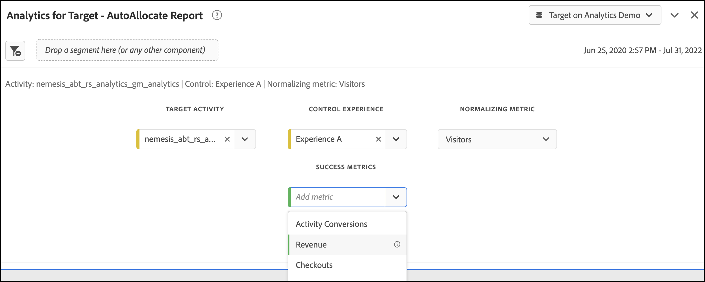

# Konfigurera A4T-rapporter i Analysis Workspace för [!DNL Auto-Allocate] verksamhet

An [!DNL Auto-Allocate] aktivitet identifierar en vinnare bland två eller fler upplevelser och omfördelar automatiskt mer trafik till vinnaren medan testet fortsätter att köras och lära sig. Analytics för Target-integrering (A4T) för [!DNL Auto-Allocate] gör att du kan se dina rapportdata i Adobe Analytics, och du kan även optimera för anpassade händelser eller mätvärden som definieras i Adobe Analytics.

Det finns omfattande analysfunktioner i Adobe Analytics Analysis Workspace, men några ändringar i standardinställningarna **[!UICONTROL Analytics for Target]** panel krävs för korrekt tolkning [!DNL Auto-Allocate] verksamhet på grund av nyanser i [optimeringskriterier](https://experienceleague.adobe.com/docs/target/using/integrate/a4t/a4t-at-aa.html?lang=en#supported).

I den här självstudiekursen går vi igenom de rekommenderade ändringarna för analys [!DNL Auto-Allocate] aktiviteter i Workspace. De viktigaste begreppen är:

* Besökare bör alltid användas som normaliseringsmått i [!DNL Auto-Allocate] verksamhet.
* När mätvärdet är ett Adobe Analytics-mått beror den lämpliga täljaren för konverteringsgraden på vilken typ av optimeringsvillkor som valts under aktivitetsinställningarna.
   * Optimeringskriterierna&quot;maximera konverteringsgraden för unika besökare&quot; har en konverteringsgrad vars täljare är ett antal unika besökare med ett positivt värde av måttet.
   * &quot;maximize metric value per visitor* har en konverteringsgrad vars täljare är det reguljära måttvärdet i Adobe Analytics. Detta anges som standard i **[!UICONTROL Analytics for Target]** i Arbetsyta.
* När optimeringsmåttet är ett måldefinierat konverteringsmått är standardvärdet **[!UICONTROL Analytics for Target]** panelen i Workspace hanterar hur du konfigurerar panelen.
* Konfidensnumren som visas i arbetsytan återspeglar inte [mer konservativ statistik som används av Automatisk allokering](https://experienceleague.adobe.com/docs/target/using/activities/auto-allocate/automated-traffic-allocation.html?lang=en#section_98388996F0584E15BF3A99C57EEB7629)och ska tas bort.

## Skapa A4T för [!DNL Auto-Allocate] panel i arbetsytan

Skapa en A4T för [!DNL Auto-Allocate] rapporten börjar med **[!UICONTROL Analytics for Target]** i Workspace, enligt nedan. Gör sedan följande val:

1. **[!UICONTROL Control Experience]**: Du kan välja vilken upplevelse du vill
2. **[!UICONTROL Normalizing Metric]**: Välj besökare - Automatisk allokering normaliserar alltid konverteringsgraden för unika besökare.
3. **[!UICONTROL Success Metrics]**: Välj samma mått som du använde när du skapade aktiviteten - om det var ett måldefinierat konverteringsmått väljer du **Aktivitetskonvertering**. Annars väljer du det Adobe Analytics-mått som du använde.

*Bild 1: Analyser för konfiguration av målpanel för [!DNL Auto-Allocate] verksamhet.*

>[!NOTE]
>
> Du kan också komma fram till en färdig **[!UICONTROL Analytics for Target]** om du klickar på länken från rapportskärmen i Adobe Target.

## Målinställningar för konvertering eller analys med optimeringskriterierna&quot;Maximera mätvärde per besökare&quot;

Standardhandtagen för A4T-panelen [!DNL Auto-Allocate] aktiviteter där målmåttet är antingen en målkonvertering eller ett analysmått med optimeringskriteriet&quot;Maximera måttvärde per besökare&quot;.

Ett exempel på den här panelen visas för intäktsmåtten där Maximera måttvärde per besökare valdes som optimeringskriterier när aktiviteten skapades. Som tidigare nämnts [!DNL Auto-Allocate] använder mer försiktiga konfidensberäkningar jämfört med dem som används i **[!UICONTROL Analytics for Target]** -panelen. Du bör därför ta bort både konfidensmåttet och relaterade värden för nedre och övre lyft.

*Bild 2: Rekommenderad rapport för [!DNL Auto-Allocate] aktiviteter med ett analysmått för att maximera måttvärdet per besökare, optimeringsvillkor. För dessa typer av mätvärden, liksom för måldefinierade konverteringsmått, är standardvärdet **[!UICONTROL Analytics for Target]**kan användas i arbetsytan.*

## Analysstatistik med optimeringskriterier för maximera konverteringsgraden för unika besökare

När ett Adobe Analytics-mått används med ett optimeringskriterium på *Maximera konverteringsgraden för unika besökare*, standardvärdet **[!UICONTROL Analytics for Target]** panelen i arbetsytan måste ändras.

Framgångsmätningen är nu ett antal unika besökare för vilka konverteringsmåttet var positivt. Detta kan du göra genom att skapa ett segment som filtrerar efter träffar med ett positivt värde i måttet. Skapa det här segmentet på följande sätt:

1. Välj **Komponenter** > **Skapa segment** i verktygsfältet Arbetsyta.
1. Dra mätvärdena som användes när aktiviteten skapades från den vänstra panelen till **Definition** segmentets ruta.
1. Välj värden för måttet som **större än** ett numeriskt värde på 0.
1. Från **Inkludera** listruta, välja **Besökare**
1. Ge segmentet ett passande namn

Ett exempel på hur segmentet skapas visas i bilden nedan, där vi väljer besökare som har värdet Intäkter.

*Bild 3: Skapa segment för Adobe Analytics-mått med optimeringskriterier som är lika med Maximera konverteringsgraden för unika besökare. I det här exemplet är mätvärdet Intäkter och optimeringsmålet är att maximera antalet besökare med positiva intäkter.*

När rätt segment har skapats används standardvärdet  **[!UICONTROL Analytics for Target]** panelen i arbetsytan kan ändras.

1. Lägg till en sekund **Unika besökare** mätvärden tillsammans med den befintliga besökarkolumnen
2. Dra segmentet som skapades under den första kolumnen för att skapa en panel som liknar bild 4. Lägg märke till skillnaden - antalet unika besökare med positiva intäkter är en bråkdel av det totala antalet unika besökare som tilldelas varje upplevelse.
   
   *Bild 4: Filtrera unika besökare efter det nya segmentet*
3. En konverteringsgrad kan [snabbt beräknad](https://experienceleague.adobe.com/docs/analytics-learn/tutorials/components/calculated-metrics/quick-calculated-metrics-in-analysis-workspace.html?lang=en) genom att markera både den första och den andra kolumnen, högerklicka, markera **Skapa mått från markering** > **Dela**. Standardkonverteringsgraden bör tas bort och ersättas med det nya beräknade måttet, som visas i bilden nedan. Du kan behöva redigera det nya beräknade måttet för att kunna visas som en **Format** > **Procent** upp till två decimaler, som visas.
   

   *Bild 4: Den slutliga panelen Automatisk fördelning visar konverteringsgraden för ett binärformat intäktskonverteringsmått*

## Slutsats

Stegen ovan visar hur du konfigurerar [!DNL Workspace] för att visa rapportdata för automatisk fördelning. Sammanfattning:

* När måttet är ett måldefinierat konverteringsmått eller ett Adobe Analytics-mått med optimeringskriterium *Maximera måttvärde per besökare* bör standardarbetsytans panel som konfigurerats med besökare som normaliseringsmått användas.
* När mätvärdet är ett Adobe Analytics-mått med optimeringskriteriet&quot;Maximera konverteringsgraden för unika besökare&quot; måste du använda en konverteringsgrad som definieras som den andel besökare som mätvärdet är positivt för. Detta görs genom att skapa ett motsvarande segment som filtrerar det unika besökarmåttet.
