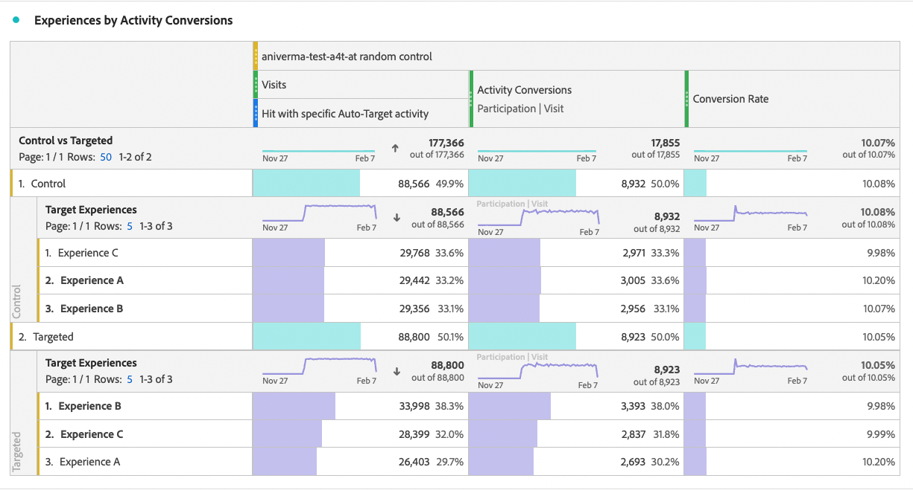

# Konfigurera A4T-rapporter i Analysis Workspace för [!DNL Auto-Target]-aktiviteter

I A4T-integreringen (Analytics for Target) för [!DNL Auto-Target]-aktiviteter används Adobe Target ML-algoritmer (Enemble Machine Learning) för att välja den bästa upplevelsen för varje besökare utifrån deras profil, beteende och kontext, allt med hjälp av ett Adobe Analytics-målmått.

Det finns omfattande analysfunktioner i Adobe Analytics Analysis Workspace, men det krävs några ändringar i standardpanelen **[!UICONTROL Analytics for Target]** för att kunna tolka [!DNL Auto-Target]-aktiviteter korrekt, på grund av skillnader mellan experimentella aktiviteter (manuell A/B och automatisk allokering) och personaliseringsaktiviteter ([!DNL Auto-Target]).

I den här självstudiekursen går vi igenom de rekommenderade ändringarna för analys av [!DNL Auto-Target]-aktiviteter i Workspace, som baseras på följande nyckelbegrepp:

* Dimensionen **[!UICONTROL Control vs Targeted]** kan användas för att skilja mellan kontrollupplevelser och de som hanteras av den ensemble ML-algoritmen [!DNL Auto-Target].
* Besök bör användas som normaliseringsmått när du visar prestandaindelningar på Experience-nivå. Dessutom kan Adobe Analytics standardberäkningsmetod för [inkludera besök där användaren inte ser aktivitetsinnehåll](https://experienceleague.adobe.com/docs/target/using/integrate/a4t/a4t-faq/a4t-faq-viewing-reports.html?lang=en#metrics), men detta standardbeteende kan ändras med ett segment med rätt omfång (se informationen nedan).
* Omfattad attribuering av besök-lookback, som också kallas besökslookback-fönstret i den förskrivna attribueringsmodellen, används av Adobe Target ML-modeller under deras utbildningsfaser, och samma (ej standard) attribueringsmodell bör användas när målmåttet bryts ned.

## Skapa A4T för panelen [!DNL Auto-Target] i arbetsytan

Om du vill skapa en A4T för [!DNL Auto-Target]-rapport börjar du med panelen **[!UICONTROL Analytics for Target]** i arbetsytan, som visas nedan, eller börjar med en friformstabell. Gör sedan följande val:

1. **[!UICONTROL Control Experience]**: Ni kan välja vilken erfarenhet ni vill; Du kommer dock att åsidosätta det här alternativet senare. Observera att för [!DNL Auto-Target]-aktiviteter är kontrollupplevelsen i själva verket en kontrollstrategi, som antingen är till för a) Slumpmässigt fungerar bland alla upplevelser, eller b) En enda upplevelse (det här valet görs när en aktivitet skapas i Adobe Target). Även om du valde (b) - din [!DNL Auto-Target]-aktivitet betecknade en specifik upplevelse som Kontroll - bör du fortfarande följa det tillvägagångssätt som beskrivs i den här självstudiekursen för att analysera A4T för [!DNL Auto-Target]-aktiviteter.
2. **[!UICONTROL Normalizing Metric]**: Välj Besök.
3. **[!UICONTROL Success Metrics]**: Även om du kan välja vilka mätvärden som ska rapporteras, bör du vanligtvis visa rapporter med samma mätvärden som valdes för optimering när aktiviteter skapades i Adobe Target.

*pngFigur 1: Analyser för konfiguration av målpanelen för  [!DNL Auto-Target] aktiviteter.*

>[!NOTE]
>
>Om du vill konfigurera din Analytics för målpanelen för Automatisk målaktivitet väljer du en kontrollupplevelse, väljer Besök som normaliseringsmått och väljer samma målmått som valdes för optimering när målaktiviteten skapades.

## Använd måttet Kontroll kontra Mål för att jämföra Adobe Target enemble ML-modell med din kontroll

A4T-standardpanelen är utformad för klassiska (manuella) A/B-tester eller automatisk fördelning-aktiviteter där målet är att jämföra prestanda för enskilda upplevelser med kontrollupplevelsen. I [!DNL Auto-Target]-aktiviteter ska dock den första orderjämförelsen vara mellan Control *strategi* och Target *strategi* (d.v.s. fastställa lyften för den totala prestandan för den [!DNL Auto-Target] enemble ML-modellen över Control Strategy).

Använd dimensionen **[!UICONTROL Control vs Targeted (Analytics for Target)]** för att utföra jämförelsen. Dra och släpp för att ersätta dimensionen **[!UICONTROL Target Experiences]** i A4T-standardrapporten.

Observera att den här ersättningen gör standardberäkningarna för Lyft och pålitlighet ogiltiga på A4T-panelen. För att undvika förvirring kan du ta bort dessa mått från standardpanelen och lämna följande rapport:

*pngFigur 2: Rekommenderad baslinjerapport för  [!DNL Auto-Target] aktiviteter. Den här rapporten har konfigurerats för att jämföra riktad trafik (hanteras av den ensemble ML-modellen) med din Control-trafik.*

>[!NOTE]
>
>För närvarande är lyft- och konfidensvärden inte tillgängliga för kontrollvärden och måldimensioner för A4T-rapporter för Automatiskt mål. Tills support har lagts till kan Lyft och pålitlighet beräknas manuellt genom att hämta [konfidensräknaren](https://experienceleague.adobe.com/docs/target/assets/complete_confidence_calculator.xlsx?lang=en).

## Lägg till analysstatistik på Experience-nivå

Om du vill få mer information om hur den ensemble ML-modellen fungerar kan du undersöka uppdelningar på Experience-nivå för dimensionen **[!UICONTROL Control vs Targeted]**. Dra dimensionen **[!UICONTROL Target Experiences]** till rapporten i Arbetsyta och bryt ned de olika måtten för Kontroll och Mål separat.

*pngFigur 3: Uppdelning av måldimensionen efter målupplevelser*

Här visas ett exempel på den resulterande rapporten.

*pngFigur 4: En standardrapport  [!DNL Auto-Target] med uppdelningar på Experience-nivå. Observera att målmåttet kan vara annorlunda och att din kontrollstrategi kan ha en enda upplevelse.*.

>[!TIP]
>
>I Arbetsyta klickar du på kugghjulsikonen för att dölja procentvärdena i kolumnen Konverteringsgrad, så att du kan fokusera på upplevelsekonverteringsgraden. Observera att konverteringsgraden då kommer att formateras som decimaler, men tolka dem som procenttal.

## Därför är &quot;besök&quot; rätt normaliseringsmått för [!DNL Auto-Target]-aktiviteter

När du analyserar en [!DNL Auto-Target]-aktivitet ska du alltid välja Besök som standardmått för normalisering. [!DNL Auto-Target] personalisering väljer en upplevelse för en besökare en gång per besök (formellt en gång per Adobe Target-session), vilket innebär att den upplevelse som visas för en användare kan ändras vid varje besök. Om du använder unika besökare som normaliseringsmått kan det faktum att en enskild användare kan få flera upplevelser (mellan olika besök) leda till förvirrande konverteringsgrader.

Ett enkelt exempel visar detta: ett scenario där två besökare deltar i en kampanj som bara har två upplevelser. Den första besökaren besöker två gånger. De tilldelas till Experience A vid det första besöket, men Experience B vid det andra besöket (eftersom deras profilstatus ändras vid det andra besöket). Efter det andra besöket konverterar besökaren genom att göra en beställning. Konverteringen tillskrivs den senast visade upplevelsen (upplevelse B). Den andra besökaren besöker också två gånger och visas Experience B båda gånger, men konverterar aldrig.

Låt oss jämföra rapporter på besökarnivå och besöksnivå:

| Upplevelse | Unika besökare | Besök | Konverteringar | Besökarnorm. Konv. Hastighet | Besök norm. Konv. Hastighet |
| --- | --- | --- | --- | --- | --- |
| A | 3 | 1 | - | 0 % | 0 % |
| B | 2 | 1 | 3 | 50 % | 33,3 % |
| Summor | 2 | 4 | 1 | 50 % | 25 % |
*Tabell 1: Exempel på jämförelse av besökarnormaliserade rapporter och besöknormaliserade rapporter för ett scenario där besluten är snäva mot ett besök (och inte besökare, som med vanlig A/B-testning). Interaktionella värden för besökare är förvirrande i det här scenariot.*

Som framgår av tabellen finns det en tydlig inkonsekvens i besökarnivånummer. Trots att det finns två unika besökare totalt är detta inte en summa unika besökare för varje upplevelse. Även om konverteringsgraden på besökarnivå inte nödvändigtvis är fel, så är konverteringsgraden på besöksnivå mer begriplig när man jämför enskilda upplevelser. Formeligen är analysenheten (&quot;besök&quot;) densamma som enheten för att fatta beslut, vilket innebär att man kan lägga till och jämföra analysdata på erfarenhetsnivå.

## Filter för faktiska besök i aktiviteten

Adobe Analytics standardberäkningsmetod för besök i en Target-aktivitet kan omfatta besök där användaren inte interagerade med Target-aktiviteten. Detta beror på hur Target-aktivitetstilldelningar bevaras i Analytics-besökarkontexten. Resultatet är att antalet besök i Target-aktiviteten ibland kan öka, vilket leder till en minskning av konverteringsgraden.

Om du föredrar att rapportera besök där användaren faktiskt interagerade med aktiviteten Automatiskt mål (antingen genom att gå in i aktiviteten, visa/besöka eller genom en konvertering) kan du:

1. Skapa ett specifikt segment som innehåller träffar från målaktiviteten i fråga och sedan
1. Filtrera Visits-måttet med det här segmentet.

**Så här skapar du segmentet:**

1. Välj alternativet **[!UICONTROL Components > Create Segment]** i verktygsfältet Arbetsyta.
2. Ange ett **[!UICONTROL Title]**-värde för ditt segment. I exemplet nedan heter segmentet [!DNL "Hit with specific Auto-Target activity"].
3. Dra **[!UICONTROL Target Activities]**-dimensionen till segmentet **[!UICONTROL Definition]**.
4. Använd operatorn **[!UICONTROL equals]**.
5. Sök efter din specifika Target-aktivitet.
6. Markera kugghjulsikonen och välj **[!UICONTROL Attribution model > Instance]** enligt bilden nedan.
7. Klicka på **[!UICONTROL Save]**.

*pngFigur 5: Använd ett segment som det som visas här för att filtrera Visits-måttet i A4T för  [!DNL Auto-Target] rapporten*

När segmentet har skapats kan du använda det för att filtrera Visits-måttet, så i Visits-mätningen inkluderas endast besök där användaren interagerade med Target-aktiviteten.

**Så här filtrerar du besök med det här segmentet:**

1. Dra det nyligen skapade segmentet från komponentverktygsfältet och hovra över basen för måttetiketten **[!UICONTROL Visits]** tills en blå **[!UICONTROL Filter by]**-prompt visas.
2. Släpp segmentet. Filtret tillämpas på det måttet.

Den sista panelen visas enligt följande.

*pngFigur 6: Rapporteringspanelen med segmentet&quot;Träff med specifik aktivitet med automatisk mål&quot; tillämpat på  [!UICONTROL Visits] måttet. Detta garanterar endast besök där en användare faktiskt interagerade med målaktiviteten i fråga ingår i rapporten.*

## Justera attribueringen mellan ML-modellutbildning och målmetrisk generering

A4T-integreringen gör att HTML-modellen för [!DNL Auto-Target] kan *tränas* med samma konverteringshändelsedata som Adobe Analytics använder för att *generera prestandarapporter*. Det finns dock vissa antaganden som måste användas för att tolka dessa data när man utbilda ML-modellerna, som skiljer sig från de standardantaganden som gjorts under rapporteringsfasen i Adobe Analytics.

Adobe Target ML-modeller använder en besöksomfångsmodell. Det innebär att de antar att en konvertering måste ske vid samma besök som en visning av aktivitetens innehåll, för att konverteringen ska&quot;tillskrivas&quot; det beslut som fattas av ML-modellen. Detta krävs för att Target ska kunna garantera snabb utbildning i sina modeller. Target kan inte vänta i upp till 30 dagar på en konvertering (standardattribueringsfönstret för rapporter i Adobe Analytics) innan det inkluderas i utbildningsdata för modellerna.

Skillnaden mellan den attribuering som används av Target:s modeller (under utbildning) och den standardattribuering som används i frågedata (under rapportgenerering) kan således leda till avvikelser. Det kan till och med verka som om ML-modellerna fungerar dåligt, när frågan i själva verket är attribuering.

>[!TIP]
>
>Om ML-modellerna optimerar för ett mätvärde som är tilldelat på ett annat sätt än det mätvärde du visar i en rapport, kanske modellerna inte fungerar som förväntat! För att undvika detta bör du se till att målmåtten i rapporten använder samma attribut som används av Target:s ML-modeller.

Följ de här stegen för att visa målmått som har samma attribueringsmetod som används i Adobe Target ML-modeller:

1. Håll muspekaren över mållätarens kugghjulsikon:
   
1. Bläddra till **[!UICONTROL Data settings]** från den resulterande menyn.
1. Välj **[!UICONTROL Use non-default  attribution model]** (om det inte redan är markerat):
   
1. Klicka på **[!UICONTROL Edit]**.
1. Välj **[!UICONTROL Model]**: **[!UICONTROL Participation]** och **[!UICONTROL Lookback window]**: **[!UICONTROL Visit]**.
   
1. Klicka på **[!UICONTROL Apply]**.

Med hjälp av de här stegen kan du försäkra dig om att målmåttet tilldelas till visningen av upplevelsen om målmåtthändelsen inträffar *någon gång* (&quot;deltagande&quot;) vid samma besök som en upplevelse visades.

## Slutligt steg: Skapa en konverteringsgrad som fångar magin ovan

Med ändringarna av besöks- och målmåtten i föregående avsnitt är den sista ändringen du bör göra av standardvärdet för A4T för [!DNL Auto-Target]-rapportpanelen att skapa konverteringsgrader som har rätt proportioner - det för ett målmått med rätt attribuering, till ett lämpligt filtrerat besöksmått.

Gör detta genom att skapa ett beräknat mått enligt följande steg:

1. Välj alternativet **[!UICONTROL Components > Create Metric]** i verktygsfältet Arbetsyta.
1. Ange ett **[!UICONTROL Title]**-värde för måttet. Exempel: &quot;Besökskorrigerad konverteringsgrad för aktivitet XXX.&quot;
1. Välj **[!UICONTROL Format]** = Procent och **[!UICONTROL Decimal Places]** = 2.
1. Dra relevanta målmått för din aktivitet (till exempel Aktivitetskonverteringar) till definitionen och använd kugghjulsikonen på det här målmåttet för att justera attribueringsmodellen till (Deltagande|Besök) enligt beskrivningen ovan.
1. Välj **[!UICONTROL Add > Container]** i det övre högra hörnet i avsnittet **[!UICONTROL Definition]**.
1. Välj divisionsoperatorn ( max) mellan de två behållarna.
1. Dra det segment som du skapade tidigare - med namnet&quot;Träff med specifik [!DNL Auto-Target]-aktivitet&quot; - i den här självstudiekursen för den här specifika [!DNL Auto-Target]-aktiviteten.
1. Dra **[!UICONTROL Visits]**-måttet till segmentbehållaren.
1. Klicka på **[!UICONTROL Save]**.

Den fullständiga definitionen för beräknade mätvärden visas här.

*pngFigur 7: Definitionen av besöks- och attribueringskorrigerad modellkonverteringsfaktor. (Observera att det här måttet är beroende av ditt målmått och din aktivitet. Den här måttdefinitionen kan alltså inte återanvändas i olika aktiviteter.)*

>[!IMPORTANT]
>
>Konverteringsgraden från A4T-panelen är inte länkad till konverteringshändelsen eller normaliseringsmåttet i tabellen. När du gör de ändringar som föreslås i den här självstudiekursen anpassas inte konverteringsgraden automatiskt till ändringarna. Om du ändrar något till en (eller båda) konverteringshändelseattribuering och normaliseringsmått måste du därför komma ihåg som ett sista steg för att även ändra konverteringsgraden, vilket visas ovan.

## Sammanfattning: Slutlig exempelarbetsyta för [!DNL Auto-Target]-rapporter

Om du kombinerar alla steg ovan till en enda panel visas i bilden nedan en fullständig vy över den rekommenderade rapporten för A4T-aktiviteter [!DNL Auto-Target]. Den här rapporten är densamma som den som används av Target maskininlärningsmodeller för att optimera målmätningen, och den innehåller alla nyanser och rekommendationer som diskuteras i den här självstudiekursen. Den här rapporten är också närmast de beräkningsmetoder som används i traditionella målrapporteringsdrivna [!DNL Auto-Target]-aktiviteter.

*pngFigur 8: Den sista A4T- [!DNL Auto-Target] rapporten i Adobe Analytics Workspace, som kombinerar alla justeringar av måttdefinitioner som beskrivs i de föregående avsnitten i det här dokumentet.*
