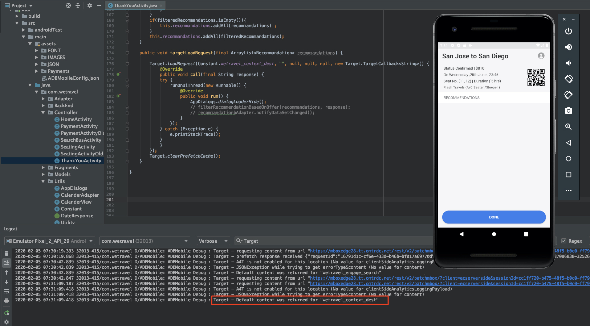

# Lägg till Adobe Target-förfrågningar

Adobe Mobile Services SDK (v4) innehåller metoder och funktioner från Adobe Target som gör att du kan anpassa din app med olika upplevelser för olika användare. Normalt görs en eller flera förfrågningar från appen till Adobe Target för att hämta det personaliserade innehållet och mäta effekten av det innehållet.

I den här lektionen förbereder du appen We.Travel för personalisering genom att implementera [!DNL Target]-begäranden.

## Förutsättningar

[Hämta och uppdatera exempelappen](download-and-update-the-sample-app.md).

## Utbildningsmål

När lektionen är klar kan du:

* Cachelagra flera [!DNL Target] erbjudanden (d.v.s. anpassat innehåll) med en förhämtningsbegäran för en batch
* Läs in förhämtade [!DNL Target] platser
* Läs in en [!DNL Target]-plats i realtid (ej förhämtad)
* Rensa förhämtade platser från cache
* Validera förhämtade begäranden och begäranden i realtid

## Terminologi

Nedan finns några viktiga Target-termer som vi kommer att använda i resten av kursen.

* **Begäran:** en nätverksbegäran till Adobe Target-servrarna
* **Erbjudande:** ett kodfragment eller annat textbaserat innehåll, som definieras i användargränssnittet [!DNL Target] (eller med API), som levereras som svar. Vanligtvis JSON när [!DNL Target] används i inbyggda mobilappar.
* **Plats:** ett användardefinierat namn som tilldelats en begäran, som används i gränssnittet [!DNL Target] för att associera erbjudanden med specifika förfrågningar
* **Gruppbegäran:** en enda begäran som innehåller flera platser
* **Förhämtningsbegäran:** en enda begäran som hämtar erbjudanden och cachelagrar dem i minnet för framtida bruk i appen
* **Förhämtningsbegäran för grupp:** en enda begäran som förhämtar erbjudanden för flera platser
* **Målgrupp:** en grupp besökare som definieras i [!DNL Target]-gränssnittet eller delas till [!DNL Target] från andra Adobe-program (t.ex.&quot;iPhone X-besökare&quot;,&quot;besökare i Kalifornien&quot;,&quot;First App Open&quot;)
* **Aktivitet:** a [!DNL Target] construct, defined in the [!DNL Target] user interface (or with API) which links locations, offers and Audiences to create a personalized experience

## Lägg till en förhämtningsbegäran för grupp

Den första begäran som vi implementerar i We.Travel är en förhämtningsbegäran för batch med två [!DNL Target] platser på hemskärmen. I en senare lektion kommer vi att konfigurera erbjudanden för dessa platser som visar meddelanden som hjälper nya användare genom bokningsprocessen.

En förhämtningsbegäran hämtar [!DNL Target]-innehåll så minimalt som möjligt genom att cachelagra Adobe Target-serversvar (erbjudande). En begäran om batchförhämtning hämtar och cachelagrar flera erbjudanden, som var och en är kopplad till en annan plats. Alla förhämtade platser cachelagras på enheten för framtida bruk i användarsessionen. Genom att förhämta flera platser på hemskärmen kan vi hämta erbjudanden som kan användas senare när besökaren navigerar genom appen. Mer information om förhämtningsmetoder finns i [förhämtningsdokumentationen](https://experienceleague.adobe.com/docs/mobile-services/android/target-android/c-mob-target-prefetch-android.html?lang=sv-SE).

### Lägg till förhämtningsbegäran för grupp

Vi uppdaterar HomeActivity-kontrollen (hemskärmens källkod), som finns under app > main > java > com.wetravel > Controller. Vi lägger till de två kodblocken som visas i rött:

Vi börjar med HomeActivity-kontrollen (hemskärmens källkod) som finns under app > main > java > com.wetravel > Controller.

Vi lägger till de två kodblocken som visas i rött:


Bläddra ned till slutet av HomeActivity-koden och lägg till koden som anges nedan efter `setHeader()`-funktionen och *ersätta* den aktuella `onResume()`-funktionen:

```java
@Override
protected void onResume() {
    super.onResume();
    targetPrefetchContent();
}

public void targetPrefetchContent() {
    List<TargetPrefetchObject> prefetchList = new ArrayList<>();
    prefetchList.add(Target.createTargetPrefetchObject(Constant.wetravel_engage_home, null));
    prefetchList.add(Target.createTargetPrefetchObject(Constant.wetravel_engage_search, null));
    Target.TargetCallback<Boolean> prefetchStatusCallback = new Target.TargetCallback<Boolean>() {
        @Override
        public void call(final Boolean status) {
            HomeActivity.this.runOnUiThread(new Runnable() {
                @Override
                public void run() {
                    String cachingStatus = status ? "YES" : "NO";
                    System.out.println("Received Response from prefetch : " + cachingStatus);
                    setUp();

                }
            });
        }};
    Target.prefetchContent(prefetchList, null, prefetchStatusCallback);
}
```

Din utvecklingsmiljö kommer antagligen att varna dig om att du inte har [!DNL Target]-klasserna importerade i filen. Se till att importera [!DNL Target]-klasserna högst upp i HomeActivity-kontrollenheten, vilket visas i rött nedan:

```java
import com.adobe.mobile.Target;
import com.adobe.mobile.TargetPrefetchObject;
```


Felen &quot;cannot find symbol variable wetravel_engage_home&quot; och &quot;cannot find symbol variable wetravel_engage_search&quot; visas förmodligen också. Lägg till dessa i filen `Constant.java` (i app > src > main > java > com > weravel > Utils):

```java
public static final String wetravel_engage_home = "wetravel_engage_home";
public static final String wetravel_engage_search = "wetravel_engage_search";
```


### Förklaring av begärandekod för batchförhämtning

| Code | Beskrivning |
|--- |--- |
| `targetPrefetchContent()` | En användardefinierad funktion (ingår inte i SDK) som använder [!DNL Target]-metoder för att hämta och cachelagra två [!DNL Target]-platser. |
| `prefetchContent()` | SDK-metoden [!DNL Target] som skickar förhämtningsbegäran |
| `Constant.wetravel_engage_home` | Förhämtat platsnamn för [!DNL Target] som visar erbjudandeinnehållet på hemskärmen |
| `Constant.wetravel_engage_search` | Förhämtat platsnamn för [!DNL Target] som visar erbjudandeinnehållet på skärmen Sökresultat. Eftersom detta är en andra plats i förhämtningen kallas denna förhämtningsbegäran för en&quot;förhämtningsbatchbegäran&quot;. |
| setUp() | En användardefinierad funktion som återger appens hemskärm efter att erbjudandena från [!DNL Target] har hämtats i förväg |

### Om asynkron jämfört med synkron

Med den kod vi just har implementerat görs förhämtningsbegäran som ett synkront, blockerande anrop, precis innan hemskärmen återges. När vi klistrade in den nya koden i HomeActivity-kontrollen flyttade vi `setUp()`-funktionskörningen från funktionen `onResume()` till efter Target-begäran. Detta kan vara bra i scenarier där du vill anpassa innehåll när appen öppnas, eftersom det ser till att anpassat innehåll från målservrarna har returnerats (eller timeout) innan den första skärmen återges. Om du vill tillåta att begäranden läses in asynkront (i bakgrunden) anropar du `setUp()` i funktionen `onCreate()` i stället.

### Validera begäran om batchförhämtning

Återskapa appen och öppna Android Emulator. (I följande skärmbilder används pixel 2 i Android Q version 9+, API-nivå 29). Prefetch-svaret ska vara &quot;prefetch response receive&quot;:

När hemskärmen återges bör förhämtningsbegäran läsas in. Med Logcat kan du filtrera efter [!DNL "Target"] för att se begäran och svar:


Om du inte ser något svar kontrollerar du inställningarna i filen `ADBMobileConfig.json` och kodsyntaxen i filen HomeActivity.

Två platser cachelagras nu till enheten. Platsnamnen kommer snart att läsas in i [!DNL Target]-gränssnittet, där de kan väljas i olika nedrullningsbara menyer när du använder dem i en aktivitet.

### Lägg till lastbegäranden för varje cachelagrad plats

Nu när platserna är förhämtade och deras svar cachelagrade till enheten lägger vi till metoden `Target.loadRequest()` som hämtar erbjudandeinnehållet från cachen så att du kan använda den för att uppdatera programmet. Vi lägger till en ny anpassad metod med namnet `engageMessage()` som körs med förhämtningsbegäran. `engageMessage()` anropar `Target.loadRequest()`. `engageMessage()` körs före `setUp()` för att säkerställa att inläsningsbegäran anropas innan skärmen konfigureras.

Lägg först till anropet och metoden `engageMessage()` för platsen wetravel_engage_home i HomeActivity:


Här är den uppdaterade koden:

```java
    public void targetPrefetchContent() {
        List<TargetPrefetchObject> prefetchList = new ArrayList<>();
        Map<String, Object> params1;
        params1 = new HashMap<String, Object>();
        params1.put("at_property", "your at_property value goes here");
        prefetchList.add(Target.createTargetPrefetchObject(Constant.wetravel_engage_home, params1));
        prefetchList.add(Target.createTargetPrefetchObject(Constant.wetravel_engage_search, params1));
        Target.TargetCallback<Boolean> prefetchStatusCallback = new Target.TargetCallback<Boolean>() {
            @Override
            public void call(final Boolean status) {
                HomeActivity.this.runOnUiThread(new Runnable() {
                    @Override
                    public void run() {
                        String cachingStatus = status ? "YES" : "NO";
                        System.out.println("Received Response from prefetch : " + cachingStatus);
                        engageMessage();
                        setUp();
                    }
                });
            }};
        Target.prefetchContent(prefetchList, null, prefetchStatusCallback);
    }
    public void engageMessage() {
        Target.loadRequest(Constant.wetravel_engage_home, "", null, null, null,
            new Target.TargetCallback<String>(){
                @Override
                public void call(final String s) {
                    runOnUiThread(new Runnable() {
                        @Override
                        public void run() {
                            System.out.println("Engage Message : " + s);
                            if(s != null && !s.isEmpty()) Utility.showToast(getApplicationContext(), s);
                        }
                    });
                }
            });
    }
```

Lägg nu till anropet och metoden `engageMessage()` för platsen wetravel_engage_search i SearchBusActivity. Observera att anropet `engageMessage()` är inställt i metoden `onResume()` före anropet till `setUpSearch()`, så det körs innan skärmen är konfigurerad:


Här är den uppdaterade koden:

```java
    @Override
    public void onResume() {
        super.onResume();
        engageMessage();
        setUpSearch();
    }
    public void engageMessage() {
        Target.loadRequest(Constant.wetravel_engage_search, "", null, null, null,
                new Target.TargetCallback<String>(){
                    @Override
                    public void call(final String s) {
                        runOnUiThread(new Runnable() {
                            @Override
                            public void run() {
                                System.out.println("Engage Message : " + s);
                                if(s != null && !s.isEmpty()) Utility.showToast(getApplicationContext(), s);
                            }
                        });
                    }
                });
    }
```

Eftersom du precis har lagt till Target-metoder i SearchBusActivity, måste du importera [!DNL Target]-klasserna:

```java
import com.adobe.mobile.Target;
import com.adobe.mobile.TargetPrefetchObject;
```

## Lägg till en begäran i realtid

Nästa begäran som vi lägger till i appen blir en begäran i realtid på Tack-skärmen. Med&quot;realtid&quot; menar vi att både begäran kommer att göras och att svaret kommer att tillämpas omedelbart (inte cachelagras senare). I en senare lektion kommer vi att bygga en upplevelse med denna begäran, som är anpassad efter användarens resa.

Låt oss lägga till en förfrågan i realtid på Tack-skärmen. I filen TackYouActivity gör vi de ändringar som visas i rött:


Bläddra till slutet av filen TackAktivitet. Kommentera de tre raderna i funktionen `getRecommandations()` och lägg till anropet för funktionen `targetLoadRequest()`:

```java
// AppDialogs.dialogLoaderHide();
// recommandations.addAll(recommandation.recommandations);
// recommandationbAdapter.notifyDataSetChanged();
```

Lägg till den här kodraden i funktionen `getRecommandations()`:

```java
targetLoadRequest(recommandation.recommandations);
```

Nu måste vi definiera funktionen `targetLoadRequest()`:


Lägg till det här kodblocket efter funktionen `filterRecommendationBasedOnOffer()`:

```java
public void targetLoadRequest(final ArrayList<Recommandation> recommandations) {
    Target.loadRequest(Constant.wetravel_context_dest, "", null, null, null, new Target.TargetCallback<String>() {
        @Override
        public void call(final String response) {
            try {
                runOnUiThread(new Runnable() {
                    @Override
                    public void run() {
                        AppDialogs.dialogLoaderHide();
                        filterRecommendationBasedOnOffer(recommandations, response);
                        recommandationbAdapter.notifyDataSetChanged();
                    }
                });
            } catch (Exception e) {
                e.printStackTrace();
            }
        }
    });
}
```

Eftersom du just har lagt till Target-metoder i TackYouActivity måste du importera Target-klasserna:

```java
import com.adobe.mobile.Target;
import com.adobe.mobile.TargetPrefetchObject;
```

### targetLoadRequest(), kodförklaring

| Code | Beskrivning |
|--- |--- |
| `targetLoadRequest()` | En användardefinierad funktion (ingår inte i SDK) som utlöser `Target.loadRequest()` som läser in och visar platsen wetravel_context_dest |
| `Target.loadRequest()` | SDK-metoden som skickar begäran till målservern |
| Constant.wetravel_context_dest | Platsnamnet som tilldelats den begäran som vi kommer att använda senare när vi skapar aktiviteten i gränssnittet [!DNL Target] |
| `filterRecommendationBasedOnOffer()` | En användardefinierad funktion i appen som hämtar platsens erbjudande från Target-svaret och avgör hur appen ska ändras baserat på erbjudandets innehåll |
| `recommandations.addAll()` | En användardefinierad funktion i appen som kördes som standard när TackYou-skärmen lästes in, men som nu körs efter att Target-svaret har tagits emot och tolkats av `filterRecommendationBasedOnOffer()` |

Det här var en mer sofistikerad uppdatering som vi gjorde i appen med den begäran vi lade till på startskärmen, så vi ska titta på vad vi gjorde:

1. Vi avbröt appens tidigare beteende att visa tre standardkampanjer genom att kommentera kodraderna
1. Vi sa åt programmet att istället köra en ny funktion, som vi godtyckligt kallar targetLoadRequest
1. Vi definierade funktionen `targetLoadRequest` för att göra en begäran till Target med metoden Target.loadRequest och omedelbart köra funktionen `filterRecommendationBasedOnOffer()` när svaret på erbjudandet från [!DNL Target] tas emot
1. Funktionen `filterRecommendationBasedOnOffer()` tolkar svaret och avgör vilka kampanjer som ska användas på skärmen

Detta är ett mycket vanligt användningsmönster när [!DNL Target] används i mobilappar.  Det är båda mycket kraftfullt, eftersom du kan anpassa praktiskt taget alla aspekter av din mobilapp. Det kräver också samordning mellan programkoden och de erbjudanden som vi definierar senare i [!DNL Target]-gränssnittet. På grund av den här samordningen kan vissa användningsexempel kräva att du uppdaterar din app i appbutiken för att starta aktiviteten.

### Validera begäran i realtid

Öppna Android Emulator och gå igenom alla steg för att boka en resa: Hem > Busssökningsresultat > Platsval, Betalningsalternativ (alla betalningsalternativ med tomma data fungerar).

På den sista Tack-skärmen tittar du på Logcat för svaret. Svaret ska vara &quot;Standardinnehåll returnerades för &quot;wetravel_context_dest&quot;:



## Rensa förhämtade platser från cache

Det kan finnas situationer där förhämtade platser måste rensas under en session. När en bokning görs är det till exempel klokt att rensa de cachelagrade platserna eftersom användaren nu är&quot;engagerad&quot; och förstår bokningsprocessen. Om de bokar en annan resa under sessionen behöver de inte de ursprungliga platserna på startskärmen och sökresultatskärmen för att vägleda bokningen. Det skulle vara vettigare att rensa platserna från cacheminnet och förhämta nya erbjudanden för kanske en rabatterad andra bokning eller ett annat relevant scenario. Logik kan läggas till på startskärmen och sökresultatskärmen för att hämta nya platser i förväg om en bokning har gjorts under sessionen.

I det här exemplet rensar vi förhämtade platser för sessionen när en bokning görs. Detta görs genom att funktionen `Target.clearPrefetchCache()` anropas. Ställ in funktionen inuti funktionen `targetLoadRequest()` så som visas nedan:

```java
Target.clearPrefetchCache()
```


Grattis! Din app har nu ramverket för personalisering. I nästa lektion ska vi förbättra våra personaliseringsfunktioner genom att lägga till parametrar till dessa platser.

**[NÄSTA : &quot;Lägg till parametrar&quot; >](add-parameters.md)**
