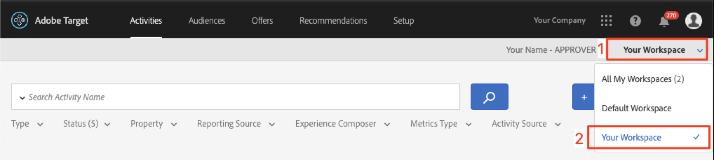

# Skapa publiker och erbjudanden i Adobe Target

I den här lektionen ska vi gå in i [!DNL Target]-gränssnittet och skapa målgrupper och erbjudanden för de tre platser som vi implementerat i föregående lektioner.

## Utbildningsmål

När lektionen är klar kan du:

* Skapa målgrupper i Adobe Target
* Skapa erbjudanden i Adobe Target

Mer specifikt kommer vi i den här lektionen att skapa målgrupper och erbjudanden som behövs för att uppnå de användningsfall för personalisering som definieras i början av självstudiekursen. Vi vill använda skärmarna Hem och Sök för att hjälpa appanvändare att boka sina resor, och vi vill använda Tack-skärmen för att visa relevanta erbjudanden baserat på användarens mål. Här följer en tabell som visar vad vi kommer att bygga i den här lektionen för varje plats:

| Plats | Målgrupp | Erbjudande |
| --- | --- | --- |
| web_engage_home | Nya mobilappsanvändare | &quot;Välj ursprung och mål för att söka efter tillgängliga bussrutter&quot; |
| web_engage_search | Nya mobilappsanvändare | &quot;Använd filter för att begränsa sökresultaten&quot; |
| web_engage_home | Returnerar användare av mobilappar | &quot;Välkommen tillbaka! Använd kampanjkoden BACK30 vid kassan för att få 10 % rabatt.&quot; |
| web_engage_search | Returnerar användare av mobilappar | standardinnehåll |
| web_context_dest | Mål: San Diego | &quot;DJ&quot; |
| web_context_dest | Destination: Los Angeles | &quot;Universal&quot; |

## Välj din Workspace

Om ditt företag använder Egenskaper och Arbetsytor för att fastställa gränser för hur appar och webbplatser ska anpassas - och du implementerade parametern at_property i den senaste lektionen - bör du först kontrollera att du är i rätt Workspace innan du fortsätter med den här lektionen. Om du inte använder Egenskaper och Arbetsytor kan du bara ignorera det här steget. Markera den Workspace som du använde i den föregående lektionen för att kopiera värdet för at_property:

## Skapa målgrupper

Nu ska vi skapa de målgrupper vi ska använda för att personalisera appen.

### Skapa en publik för nya användare

Adobe Target-målgrupper används för att identifiera särskilda grupper av besökare. Erbjudandena kan sedan riktas till dessa specifika grupper. För de första två platserna använder vi en&quot;New Users&quot;-målgrupp:

1. Klicka på **[!UICONTROL Audiences]** i den övre navigeringen.
1. Klicka på knappen **[!UICONTROL Create Audience]**.
   

1. Ange **[!UICONTROL New Mobile App Users]** som målgruppsnamn.
1. Välj **[!UICONTROL Add Rule]**.
1. Välj en **[!UICONTROL Custom]**-regel.
   

1. Välj **[!UICONTROL a.Launches]**.
1. Välj **[!UICONTROL is less than]**.
1. Ange **5**.
1. Spara nya målgrupper.
   

### Skapa en publik för återkommande användare

Följ stegen ovan för att skapa en publik som returnerar användare.

1. Namnge målgruppen _Returnerar mobilappsanvändare_.
1. Använd **[!UICONTROL a.Launches is greater than or equal to 5]** som anpassad regel.
1. Spara nya målgrupper.

   

>[!NOTE]
>
>Alla livscykelvärden och dimensioner som samlas in i den mobila SDK:n [!DNL Target] är fördefinierade med&quot;a&quot; (t.ex. a.Launches) och är tillgängliga i alternativet&quot;Custom&quot; (Anpassad) på den nedrullningsbara menyn och kan användas för att skapa målgrupper.

### Skapa en publik för användare som bokar en resa till San Diego

Därefter ska vi skapa några målgrupper för några av de destinationer som erbjuds av appen We.Travel. I den sista lektionen passerade vi målet som en positionsparameter i platsförfrågan wetravel_context_dest. Den parametern är tillgänglig i alternativet Egen på den nedrullningsbara menyn.

>[!NOTE]
>
>Om en parameter som du förväntar ska visas i listrutan Egen inte visas i gränssnittet [!DNL Target], kontrollerar du att den skickas i begäran. Om du har verifierat att det finns i begäran men inte har lästs in i [!DNL Target]-gränssnittet, kan du bara skriva parameternamnet och trycka på Retur för att fortsätta definiera målgruppen

1. Namnge målgruppen _Mål: San Diego_.
1. Använd en anpassad regel med den här definitionen: _locationDest innehåller San Diego_.
1. Spara nya målgrupper.

   

### Skapa en publik för användare som bokar en resa till Los Angeles

1. Namnge målgruppen _Mål: Los Angeles_
1. Använd en anpassad regel med den här definitionen: _locationDest innehåller Los Angeles_
1. Spara nya målgrupper.

## Skapa erbjudanden

Nu ska vi skapa erbjudanden för att visa dessa meddelanden. Som en påminnelse är erbjudanden kodfragment/innehåll som levereras i svaret på [!DNL Target]. De skapas oftast i användargränssnittet [!DNL Target], men kan också skapas via API eller med Experience Fragments-integrering med Adobe Experience Manager. I mobilappar är JSON-erbjudanden vanliga. I den här självstudiekursen kommer vi att använda HTML-erbjudanden, som kan användas för att leverera allt slags textinnehåll (inklusive JSON) i appen.

### Skapa erbjudandet för nya användare

Först ska vi skapa erbjudanden för nya användare:

1. Klicka på **[!UICONTROL Offers]** i den övre navigeringen.
1. Klicka på **[!UICONTROL Create]**.
1. Välj **[!UICONTROL HTML Offer]**.

   

1. Ge erbjudandet namnet _Hem: Engagera nya användare_.
1. Ange _Välj Source och Mål om du vill söka efter tillgängliga bussar_ som kod.
1. Spara det nya erbjudandet.

   

### Skapa erbjudandet för återkommande användare

Nu ska vi skapa ett erbjudande för återkommande användare (det andra erbjudandet blir standardinnehåll, som visas som ingenting):

1. Ge erbjudandet namnet _Hem: Returnerar användare_.
1. Ange _Välkommen tillbaka! Använd kampanjkoden BACK30 vid kassan för att få 10 % rabatt._ som HTML-kod.
1. Spara det nya erbjudandet.

   

### Skapa erbjudandet för San Diego

När&quot;DJ&quot; returneras till aktiviteten TackYou visas en banderoll för funktionen filterrecommendationBasedOnOffer() för&quot;Rock Night with DJ SAM&quot;:

1. Ange erbjudandet _Erbjudande för San Diego_.
1. Ange _DJ_ som HTML-kod.
1. Spara det nya erbjudandet.

### Skapa erbjudande för användare som ska till Los Angeles

När &quot;Universal&quot; returneras till aktiviteten TackYou visas en banderoll för &quot;Universal Studios&quot; i funktionen filterRecommendedOnOffer():

1. Ange erbjudandet _Erbjudande för Los Angeles_.
1. Ange _Universal_ som HTML-kod.
1. Spara det nya erbjudandet.

## Slutsats

Nu har vi våra målgrupper och erbjudanden. I nästa lektion ska vi bygga aktiviteter som knyter samman platser, målgrupper och erbjudanden för att skapa personaliserade upplevelser!

**[NÄSTA :&quot;Anpassa layouter&quot; >](personalize-layouts.md)**
