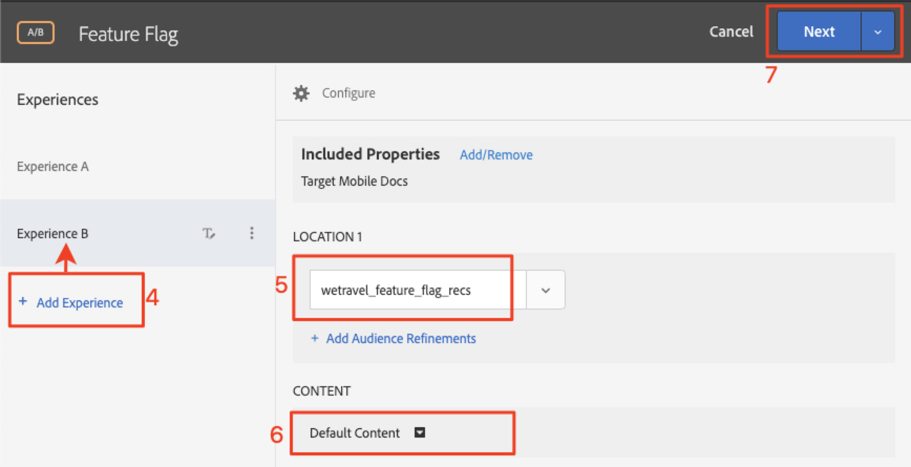

# Funktionsflaggning

Ägare av mobilappsprodukter behöver flexibiliteten att kunna lansera nya funktioner i sina appar utan att behöva investera i flera appreleaser. De kanske också vill lansera funktioner gradvis till en procentandel av användarbasen för att testa effektiviteten. Adobe Target kan användas för att experimentera med UX-funktioner som färg, kopiering, knappar, text och bilder och för att ge dessa funktioner till specifika målgrupper.

I den här lektionen ska vi skapa ett&quot;funktionsflagga&quot;-erbjudande som kan användas som utlösare för att aktivera specifika appfunktioner.

## Utbildningsmål

När lektionen är klar kan du:

* Lägg till en ny plats i förhämtningsbegäran för batch
* Skapa en [!DNL Target]-aktivitet med ett erbjudande som ska användas som funktionsflagga
* Läs in och validera erbjudandet om funktionsflagga i din app

## Lägg till en ny plats till förhämtningsbegäran i hemaktiviteten

I demoappen från våra tidigare lektioner ska vi lägga till en ny plats som heter&quot;wetravel_feature_flag_recs&quot; i förhämtningsbegäran i hemaktiviteten och läsa in den på skärmen med en ny Java-metod.

>[!NOTE]
>
>En av fördelarna med att använda en förhämtningsbegäran är att tillägg av en ny begäran inte lägger till ytterligare nätverksbelastning eller orsakar ytterligare laddningsarbete eftersom begäran paketeras i förhämtningsbegäran

Kontrollera först att konstanten wetravel_feature_flag_recs har lagts till i filen Constant.java:


Här är koden:

```java
public static final String wetravel_feature_flag_recs = "wetravel_feature_flag_recs";
```

Lägg nu till platsen i förhämtningsbegäran och läs in en ny funktion med namnet `processFeatureFlags()`:


Här är den fullständiga uppdaterade koden:

```java
public void targetPrefetchContent() {
    List<TargetPrefetchObject> prefetchList = new ArrayList<>();

    Map<String, Object> params1;
    params1 = new HashMap<String, Object>();
    params1.put("at_property", "7962ac68-17db-1579-408f-9556feccb477");

    prefetchList.add(Target.createTargetPrefetchObject(Constant.wetravel_engage_home, params1));
    prefetchList.add(Target.createTargetPrefetchObject(Constant.wetravel_engage_search, params1));
    prefetchList.add(Target.createTargetPrefetchObject(Constant.wetravel_feature_flag_recs, params1));

    Target.TargetCallback<Boolean> prefetchStatusCallback = new Target.TargetCallback<Boolean>() {
        @Override
        public void call(final Boolean status) {
            HomeActivity.this.runOnUiThread(new Runnable() {
                @Override
                public void run() {
                    String cachingStatus = status ? "YES" : "NO";
                    System.out.println("Received Response from prefetch : " + cachingStatus);
                    engageMessage();
                    processFeatureFlags();
                    setUp();

                }
            });
        }};
    Target.prefetchContent(prefetchList, null, prefetchStatusCallback);
}

public void processFeatureFlags() {
    Target.loadRequest(Constant.wetravel_feature_flag_recs, "", null, null, null,
            new Target.TargetCallback<String>(){
                @Override
                public void call(final String s) {
                    runOnUiThread(new Runnable() {
                        @Override
                        public void run() {
                            System.out.println("Feature Flags : " + s);
                            if(s != null && !s.isEmpty()) {
                                //enable or disable features
                            }
                        }
                    });
                }
            });
}
```

### Validera begäran om funktionsflagga

När koden har lagts till kör du emulatorn på hemaktiviteten och tittar på Logcat för det uppdaterade svaret:


## Skapa ett JSON-erbjudande för funktionsflagga

Nu ska vi skapa ett enkelt JSON-erbjudande som fungerar som en flagga eller utlösare för en viss målgrupp - den målgrupp som skulle få tillgång till funktionen i sin app. Skapa ett nytt erbjudande i [!DNL Target]-gränssnittet:


Låt oss kalla det&quot;Funktionsflagga v1&quot; med värdet {&quot;enable&quot;:1&quot;


## Skapa en aktivitet

Nu ska vi skapa en A/B-testaktivitet med det erbjudandet. Mer information om hur du skapar en aktivitet finns i föregående lektion. Aktiviteten behöver bara en målgrupp för det här exemplet. I ett livescenario kanske du vill bygga ut specifika anpassade målgrupper för specifika funktionsåterställningar och sedan ställa in aktiviteten så att den använder dessa målgrupper. I det här exemplet allokerar vi bara 50/50-trafik (50 % till besökare som skulle se funktionsuppdateringarna och 50 % till besökare som skulle se en standardupplevelse). Här är konfigurationen för aktiviteten:

1. Namnge aktiviteten &quot;Feature Flag&quot;
1. Välj platsen &quot;wetravel_feature_flag_recs&quot;
1. Ändra innehållet till JSON-erbjudandet&quot;Feature Flag v1&quot;

   

1. Klicka på **[!UICONTROL Add Experience]** för att lägga till upplevelse B.
1. Lämna platsen &quot;wetravel_feature_flag_recs&quot;
1. Lämna **[!UICONTROL Default Content]** för innehållet
1. Klicka på **[!UICONTROL Next]** för att gå vidare till skärmen [!UICONTROL Targeting]

   

1. På skärmen [!UICONTROL Targeting] kontrollerar du att metoden [!UICONTROL Traffic Allocation] är inställd på standardinställningen (Manuell) och att varje upplevelse har standardallokeringen på 50 %. Välj **[!UICONTROL Next]** om du vill gå vidare till **[!UICONTROL Goals & Settings]**.

   

1. Ange **[!UICONTROL Primary Goal]** som **[!UICONTROL Conversion]**.
1. Ställ in åtgärden på **[!UICONTROL Viewed an Mbox]**. Vi använder platsen&quot;wetravel_context_dest&quot; (eftersom den här platsen finns på bekräftelseskärmen kan vi använda den för att se om den nya funktionen leder till fler konverteringar).
1. Klicka på **[!UICONTROL Save & Close]**.

   

Aktivera aktiviteten.

## Validera aktiviteten för funktionsflagga

Använd nu emulatorn för att bevaka begäran. Eftersom vi har angett målinriktningen till 50 % av användarna visas ett 50-procentigt svar på funktionsflaggan som innehåller `{enable:1}`-värdet.


Om du inte kan se `{enable:1}`-värdet innebär det att du inte har något mål för upplevelsen. Som ett tillfälligt test kan du tvinga fram erbjudandet:

1. Inaktivera aktiviteten.
1. Ändra trafiktilldelningen till 100 % för den nya funktionsupplevelsen.
1. Spara och återaktivera.
1. Rensa data på emulatorn och starta sedan om programmet.
1. Erbjudandet bör nu returnera `{enable:1}`-värdet.

I ett livescenario kan `{enable:1}`-svaret användas för att aktivera mer anpassad logik i din app för att visa den specifika funktionsuppsättning som du vill visa målgruppen.

## Slutsats

Snyggt jobbat! Du har nu de kunskaper som krävs för att lansera funktioner för specifika användargrupper.
