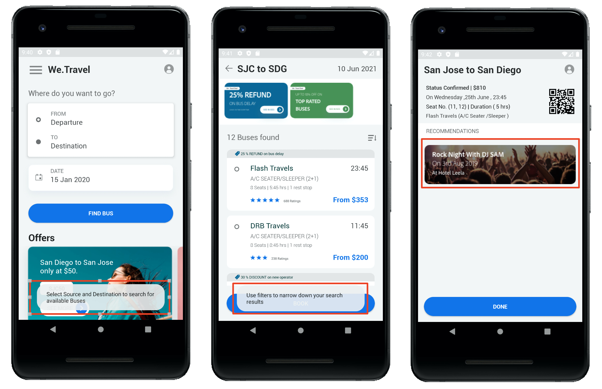

# Adobe Target med Adobe Mobile Services SDK v4 för Android - översikt

_Adobe Target med Adobe Mobile Services SDK v4 för_ Android är den perfekta startpunkten för Android-utvecklare som redan använder Adobe Mobile Services SDK v4 och vill börja personalisera appupplevelser med Adobe Target.

Du får en demo-Android-app för att slutföra lektionerna. När du är klar med den här självstudiekursen kan du börja implementera [!DNL Target] i din egen Android-app!

När du är klar med den här självstudiekursen kan du:

* Verifiera installationen av [Adobe Mobile Services SDK](https://docs.adobe.com/content/help/en/mobile-services/android/getting-started-android/requirements.html)
* Implementera följande typer av [!DNL Target]-begäranden:
   * Förhämtning av [!DNL Target]-innehåll
   * Gruppera flera [!DNL Target] platser (mbox) i en enda begäran
   * Blockera begäranden (körs före appvisning)
   * Ej blockerande begäranden (körs i bakgrunden)
   * Realtid (icke-cachelagring)
   * Cachebusting-uppdatering
* Lägg till parametrar i förfrågningar om förbättrad personalisering
* Skapa målgrupper och erbjudanden
* Anpassa layouter
* Nya funktioner med funktionsflaggning

## Förutsättningar

I dessa lektioner antas att du:

* Ha ett Adobe-ID och åtkomst på godkännarnivå till Adobe Target-gränssnittet (se verifieringsstegen nedan)
* Lär känna Adobe Target klientkod så att du kan göra förfrågningar till ditt eget konto. Klientkoden visas i Adobe Target-gränssnittet på   Inställningar > Implementering > Redigera skärmen för at.js-inställningar
* Har tillgång till och är bekanta med användargränssnittet [Mobile Services](https://mobilemarketing.adobe.com)
* Utveckla mobilappar med IDE för Android. Den här självstudiekursen innehåller [Android Studio](https://developer.android.com/studio/install) i olika steg och skärmbilder

Om du inte har den behörighet som krävs för Experience Cloud Solutions, kontakta din Experience Cloud-administratör.

Du måste också känna till Android-utvecklingen i Java. Du behöver inte vara Java-expert för att slutföra lektionerna, men du får ut mer av dem om du kan läsa och förstå koden på ett bekvämt sätt.

### Verifiera åtkomst till Adobe Target

Den här lektionen kräver tillgång till Adobe Target. Innan du går igenom de följande stegen måste du se till att du har tillgång till Adobe Target genom att göra följande:

1. Logga in på [Adobe Experience Cloud](https://experience.adobe.com/)
1. Klicka på [!DNL Target] från startskärmen i Experience Cloud:
   
1. Du bör gå till aktivitetslistan i Adobe Target, som bilden nedan visar, och du bör se att din användare har åtkomst på godkännarnivå. Om du inte kan komma åt [!DNL Target] eller verifiera åtkomsten på godkännarnivå kontaktar du en av ditt företags Experience Cloud-administratörer, begär den här åtkomsten och återupptar den här självstudiekursen när den har beviljats:

   

## Om lektionerna

I den här lektionen ska du implementera Adobe Target i en demoreseapp som heter&quot;We.Travel&quot; med ditt eget Adobe Target-konto. I slutet av självstudiekursen kommer du att leverera personaliserade meddelanden till användaren baserat på hur de använder appen! De slutliga personaliseringsupplevelserna kommer att se ut så här:

När du gått igenom implementeringen i appen We.Travel kan du börja använda [!DNL Target] i din egen mobilapp.

Kom så börjar vi!

**[NÄSTA: &quot;Ladda ned och uppdatera exempelappen&quot; >](download-and-update-the-sample-app.md)**
