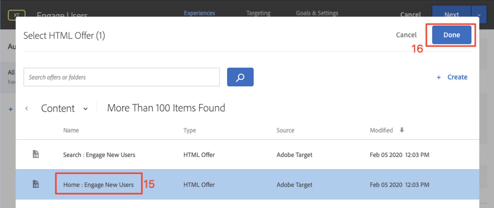

# Anpassa layouter

Nu är det dags att sammanföra allt och skapa personaliserade upplevelser. En _aktivitet_ är [!DNL Target]-mekanismen som länkar platserna, målgrupperna och erbjudandena tillsammans, så att [!DNL Target] svarar på det anpassade innehållet när förfrågan görs från appen. Vi skapar två personaliseringsaktiviteter i [!DNL Target] och validerar att det anpassade innehållet visas för rätt användare vid rätt tidpunkt och på rätt plats.

## Utbildningsmål

När lektionen är klar kan du:

* Bygg aktiviteter i Adobe Target
* Validera aktiviteterna i exempelappen

## Skapa aktiviteter i Adobe Target

Lär dig skapa aktiviteter för engagerande användare och sammanhangsbaserade erbjudanden.

### Första aktiviteten -&quot;Engagera användare&quot;

Här är en sammanfattning av aktiviteten vi ska bygga:

| Målgrupp | Platser | Erbjudanden |
|---|---|---|
| Nya mobilappsanvändare | web_engage_home, wetravel_engage_search | Hem: Engagera nya användare, sök: Engagera nya användare |
| Returnerar användare av mobilappar | web_engage_home, wetravel_engage_search | Hem: Returnerande användare, default_content |

Gör följande i gränssnittet [!DNL Target]:

1. Välj **[!UICONTROL Activities]** > **[!UICONTROL Create Activity]** > **[!UICONTROL Experience Targeting]**.

   

1. Klicka på **[!UICONTROL Mobile App]**.
1. Välj **[!UICONTROL Form composer]**.
1. Markera arbetsytan (samma arbetsyta som du använde i tidigare lektioner).
1. Välj din egenskap (samma egenskap som du använde i tidigare lektioner).
1. Klicka på **[!UICONTROL Next]**.

   

1. Ändra aktivitetstiteln till **[!UICONTROL Engage Users]**.
1. Välj **[!UICONTROL ellipsis]** > **[!UICONTROL Change Audience]**.
   
1. Ange målgruppen till **[!UICONTROL New Mobile App Users]**.
1. Klicka på **[!UICONTROL Done]**.
   

1. Ändra platsen till _wetravel_engage_home_.
1. Markera listrutepilen bredvid Standardinnehåll och välj **[!UICONTROL Change HTML Offer]**.

   

1. Välj erbjudandet **[!UICONTROL Home: Engage New Users]**.
1. Välj **[!UICONTROL Done]**.

   

1. Välj **[!UICONTROL Add Location]**.
   

1. Välj platsen _wetravel_engage_search_.
1. Ändra HTML.

   

1. Välj erbjudandet **[!UICONTROL Search: Engage New Users]**.
1. Klicka på **[!UICONTROL Done]**.

   

Ni har just kopplat samman en målgrupp med platser och erbjudanden, vilket skapar en personaliserad upplevelse för de nya mobilappsanvändarna! Nu bör upplevelsen se ut så här:

Skapa nu en upplevelse för återkommande användare av mobilappar:

1. Välj **[!UICONTROL Add Experience Targeting]** till vänster.
1. Välj målgrupp **[!UICONTROL Returning Mobile App Users]**.
1. Välj **[!UICONTROL Done]**.
   

Använd nu samma process som vi använde tidigare för att konfigurera den nya upplevelsen. Konfigurationen för den returnerade användarupplevelsen för mobilappar bör se ut så här:

Vi fortsätter till nästa skärm i konfigurationen:

1. Klicka på **[!UICONTROL Next]** för att gå till skärmen **[!UICONTROL Targeting]**.
1. Använd standardinställningarna för Riktning. Om du hade upplevelser för överlappande målgrupper (t.ex. _New York-användare_ och _förstagångsanvändare_) kan du ordna prioritetsordningen på den här skärmen.
1. Klicka på **[!UICONTROL Next]** om du vill gå vidare till **[!UICONTROL Goals & Settings]**.

   

Nu ska vi slutföra aktivitetsinställningarna:

1. Ange **[!UICONTROL Primary Goal]** som **[!UICONTROL Conversion]**.
1. Ange åtgärden till **[!UICONTROL Viewed an mbox]** > _wetravel_context_dest_ (eftersom den här platsen finns på bekräftelseskärmen kan vi använda den för att mäta konverteringar).

   

1. Behåll alla andra inställningar på skärmen till standardinställningarna.
1. Klicka på **[!UICONTROL Save & Close]** för att spara aktiviteten.
1. Aktivera **[!UICONTROL Activity]** på nästa skärm.

Vår första aktivitet är nu levande och redo att testas!

### Andra aktiviteten -&quot;Kontextuella erbjudanden&quot;

Här är en sammanfattning av den andra aktiviteten vi ska bygga:

| Målgrupp | Plats | Erbjudanden |
| --- | --- | --- |
| Mål: San Diego | web_context_dest | Kampanj för San Diego |
| Destination: Los Angeles | web_context_dest | Kampanj för Los Angeles |

Upprepa samma process som ovan för nästa aktivitet -&quot;Kontextuella erbjudanden&quot;. Slutkonfigurationen för båda upplevelserna visas nedan:

#### San Diego

#### Los Angeles

I steget Mål och inställningar ändrar vi det primära målet till den plats där bokningsbekräftelseskärmen visas:

1. Under **[!UICONTROL Reporting Settings]** anger du **[!UICONTROL Primary Goal]** till **[!UICONTROL Conversion]**.
1. Ställ in åtgärden på **[!UICONTROL Viewed an mbox]** > _wetravel_context_dest_ (i den här aktiviteten är det här måttet praktiskt taget meningslöst eftersom det också är den plats som levererar upplevelsen).
1. Klicka på **[!UICONTROL Save & Close]**.

Aktivera aktiviteten på nästa skärm.

Nu är vår andra aktivitet live och redo att testa!

## Validera erbjudandet

Kör Emulatorn och håll utkik efter det första erbjudandet som ska visas längst ned på startskärmen. Om du är en återkommande användare med fem eller fler appstarter visas erbjudandet _Välkommen tillbaka_. Om du är en ny användare (mindre än fem program startas) bör du se meddelandet _ny användare_:

Om det nya användarerbjudandet inte visas provar du med att rensa data för emulatorn. Då återställs programmet till 1 nästa gång du startar det. Detta görs under **[!UICONTROL Tools]** > **[!UICONTROL AVD Manager]**. Du kan också behöva starta om Android Studio om Logcat inte fungerar som det ska:

Du kan också validera svaret i Logcat genom att filtrera för _wetravel_engage_home_:

## Validera sökerbjudandet

Välj **[!UICONTROL San Jose]** som din **[!UICONTROL Departure]** och **[!UICONTROL San Diego]** som din **[!UICONTROL Destination]** och klicka på **[!UICONTROL Find Bus]** för att söka efter tillgängliga bussar.

På resultatskärmen bör du se meddelandet _use filters_. Om du är en återkommande användare med 5 eller fler appar startas visas inget meddelande här eftersom standardinnehållet har angetts för den här platsen (som är tom):

## Validera kontextuella erbjudanden på Tack-skärmen

Fortsätt nu genom bokningsprocessen:

* Välj en buss på resultatskärmen.
* Välj en plats på utcheckningsskärmen.
* Välj **[!UICONTROL Credit Card]** på betalningsskärmen (lämna betalningsinformationen tom - ingen faktisk bokning görs).

Eftersom San Diego valdes som mål bör du se bannern _DJ SAM_ på bekräftelseskärmen:

Välj nu **[!UICONTROL Done]** och försök med en annan bokning med Los Angeles som mål. Bekräftelseskärmen ska visa bannern _Universal Studios_:

## Slutsats

Grattis! Detta avslutar huvuddelen av självstudiekursen för Adobe Target SDK 4.x för Android. Nu har du kunskapen att implementera personalisering i Android-appar! Du kan använda den här dokumentationen och demoappen som referens för dina framtida projekt.

Därefter: Funktionsflaggning är en annan funktion som kan implementeras med Adobe Target i Android. Läs nästa lektion om hur du flaggar funktioner.

**[NÄSTA : Funktionsflaggning >](feature-flagging.md)**
