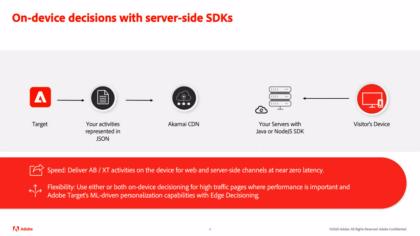

# Lär dig använda Adobe Target

[!DNL Adobe Target] är [!DNL Adobe Experience Cloud] som innehåller allt ni behöver för att skräddarsy och personalisera kundernas upplevelse. [!DNL Target] hjälper er att maximera intäkterna från era webbplatser och mobilsajter, appar, sociala medier och andra digitala kanaler. Använd dessa videor och självstudiekurser för att lära dig de många komponenterna i [!DNL Adobe Target].

>[!NOTE]
>
>Utöver den här guiden finns följande [!DNL Adobe Target] Det finns även stödlinjer:
>
>* *[Användarhandbok om Adobe Target Business Practitioner](https://experienceleague.adobe.com/docs/target/using/target-home.html){target=_blank}*
>
>* *[Adobe Target Developer Guide](https://experienceleague.adobe.com/docs/target-dev/developer/overview.html){target=_blank}*

## Nyheter

Följande resurser är nya:

* **[Konfigurera A4T-rapporter i [!DNL Analysis Workspace] for [!DNL Auto-Allocate] verksamhet](integrations/set-up-a4t-reports-in-analysis-workspace-for-auto-allocate-activities.md){target=_blank}**

   *För yrkesverksamma: The [!UICONTROL Analytics for Target] (A4T)-integrering för [!UICONTROL Auto-Allocate] gör att du kan se dina rapportdata i [!DNL Adobe Analytics]och du kan även optimera för anpassade händelser eller mätvärden som definieras i [!DNL Analytics].*

* **[Konfigurera A4T-rapporter i [!DNL Analysis Workspace] for [!UICONTROL Auto-Target] verksamhet](integrations/set-up-a4t-reports-in-analysis-workspace-for-auto-target-activities.md){target=_blank}**

   *För yrkesverksamma: Använder du A4T för [!UICONTROL Auto-Target]? Följ de här stegen för att konfigurera A4T-rapporter i [!DNL Analysis Workspace] för att säkerställa att du får förväntade resultat när du kör [!UICONTROL Auto-Target] verksamhet.*

* **[Enhetsbeslut](implementation/on-device-decisioning-overview.md)**

   *För arkitekter: Kom igång med [!UICONTROL on-device decisioning] för att leverera upplevelser som är nära noll till era kunder.*

* **[Migrera [!DNL Target] från at.js 2.x till [!DNL Platform Web SDK]](https://experienceleague.adobe.com/docs/platform-learn/migrate-target-to-websdk/introduction.html){target=_blank}**

   *Lär dig hur du migrerar en [!DNL Target] at.js implementering till [!DNL Adobe Experience Platform Web SDK].*

## Mest populära videor

<table>
<tr>
  <td>
    
    

      <a href="https://experienceleague.adobe.com/docs/target-dev/developer/server-side/on-device-decisioning/overview.html">
    <strong>Översikt över beslut på enheter</strong>
    </a>
    

    <!--- 

    <em>Learn how to implement the Adobe Target extension with a page load request and custom parameters.</em>
    
 --->
  </td>
   <td>
    
    

    <a href="https://experienceleague.adobe.com/docs/target-learn/tutorials/implementation/2.1-intro-to-target-implementation.html">
    <strong>Introduktion till Adobe Target</strong>
    </a>
    

    <!--- 

    <em> Learn how to implement at.js 2.0 (and later) in SPAs.</em>
    
 --->
  </td>
  <td>
    
    

      <a href="https://experienceleague.adobe.com/docs/target-learn/tutorials/audiences/create-profile-scripts.html">
    <strong>Skapa profilskript i Adobe Target</strong>
    </a>
    

    <!--- 

    <em>Learn how to use the Adobe Experience Cloud Debugger to understand your [!DNL Target] implementation. Learn how to quickly view your library configuration, examine requests to make sure that your custom parameters are being passed correctly, turn on console logging, and disable all [!DNL Target] requests, and use the Mbox Trace tool.</em>
    
 --->
  </td>
</tr>
</table>

## Personalval

<table>
<tr>
  <td>
    
    

      <a href="https://experienceleague.adobe.com/docs/platform-learn/implement-in-websites/implement-solutions/target.html">
    <strong>Implementera mål med Adobe Experience Platform-taggar</strong>
    </a>
    

    

    <em>Lär dig hur du implementerar Adobe Target-tillägget med en sidinläsningsbegäran och anpassade parametrar.</em>
    

  </td>
   <td>
    
    

    <a href="https://experienceleague.adobe.com/docs/target-learn/tutorials/implementation/implement-atjs-20-in-a-single-page-application.html">
    <strong>Implementera Adobe Target at.js 2.0 i ett enkelsidigt program (SPA)</strong>
    </a>
    

    

    <em> Lär dig implementera at.js 2.0 (och senare) i SPA.</em>
    

  </td>
  <td>
    
    

      <a href="https://experienceleague.adobe.com/docs/target-learn/tutorials/troubleshooting/troubleshoot-with-the-experience-cloud-debugger.html">
    <strong>Felsök Target med Experience Cloud Debugger</strong>
    </a>
    

    

    <em>Lär dig använda Adobe Experience Cloud Debugger för att förstå dina [!DNL Target] implementering. Lär dig hur du snabbt visar din bibliotekskonfiguration, undersöker begäranden för att se till att dina anpassade parametrar skickas korrekt, aktiverar konsolloggning och inaktiverar alla [!DNL Target] begär och använder Mbox Trace-verktyget.</em>
    

  </td>
</tr>
</table>