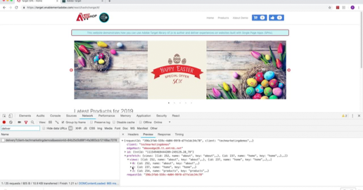

# Adobe Target Tutorials

Adobe Target är en Adobe Experience Cloud-lösning som innehåller allt ni behöver för att skräddarsy och personalisera kundupplevelsen, så att ni kan maximera intäkterna från era webbplatser, mobilsajter, appar, sociala medier och andra digitala kanaler. Använd dessa videor och självstudiekurser för att lära dig de många komponenterna i Adobe Target.

## Nyheter

* **[Använda Recommendations API (självstudiekurs)](recommendations-api-tutorial/recs-api-overview.md)**

    
   *För utvecklare: Praktiska tips om hur du använder API:[!DNL Recommendations]er för att konfigurera och hantera[!DNL Recommendations]kataloger och anpassade kriterier, med mera.*

* **[Implementera Adobe Target med Adobe Mobile Services SDK v4 för Android (självstudiekurs)](mobile-v4/overview.md)**

    
   *För utvecklare som redan använder Adobe Mobile Services SDK v4: lär dig hur ni börjar personalisera appupplevelser med Adobe Target. Dessa steg tillhandahålls som äldre användarsupport.<!-- Concepts learned here are also applicable to Adobe Experience Platform Mobile SDK (v5).-->*

* **[Använd Recommendations-erbjudanden (video)](recommendations/use-recommendations-offers.md)**

    
   *För alla målanvändare: Lär dig hur du använder produktrekommendationer i A/B- och Experience Targeting-aktiviteter.*

<!--
* **[Create a Recommendations Activity (Video)](recommendations/create-a-recommendations-activity.md)**
     
    *Recommend products to your customers at scale with this Premium feature.* -->

## Personalval

<table>
<tr>
  <td>
    
    

      <a href="https://docs.adobe.com/content/help/en/experience-cloud/implementing-in-websites-with-launch/implement-solutions/target.html">
    <strong>Implementera Target med Adobe Experience Platform Launch</strong>
    </a>
    

    

    <em>Snabbare webbimplementering med Launch</em>
    

  </td>
  <td>
    
    

      <a href="implementation/implement-atjs-20-in-a-single-page-application.md">
    <strong>Implementera at.js 2.0 i ett Single Page Application (SPA)</strong>
    </a>
    

    

    <em>Se hur at.js 2.x stöder SPA</em>
    

  </td>
  <td>
    
    

      <a href="troubleshooting/troubleshoot-with-the-experience-cloud-debugger.md">
    <strong>Felsök Target med Experience Cloud Debugger</strong>
    </a>
    

    

    <em>Zooma in implementeringen</em>
    

  </td>
</tr>
</table>
