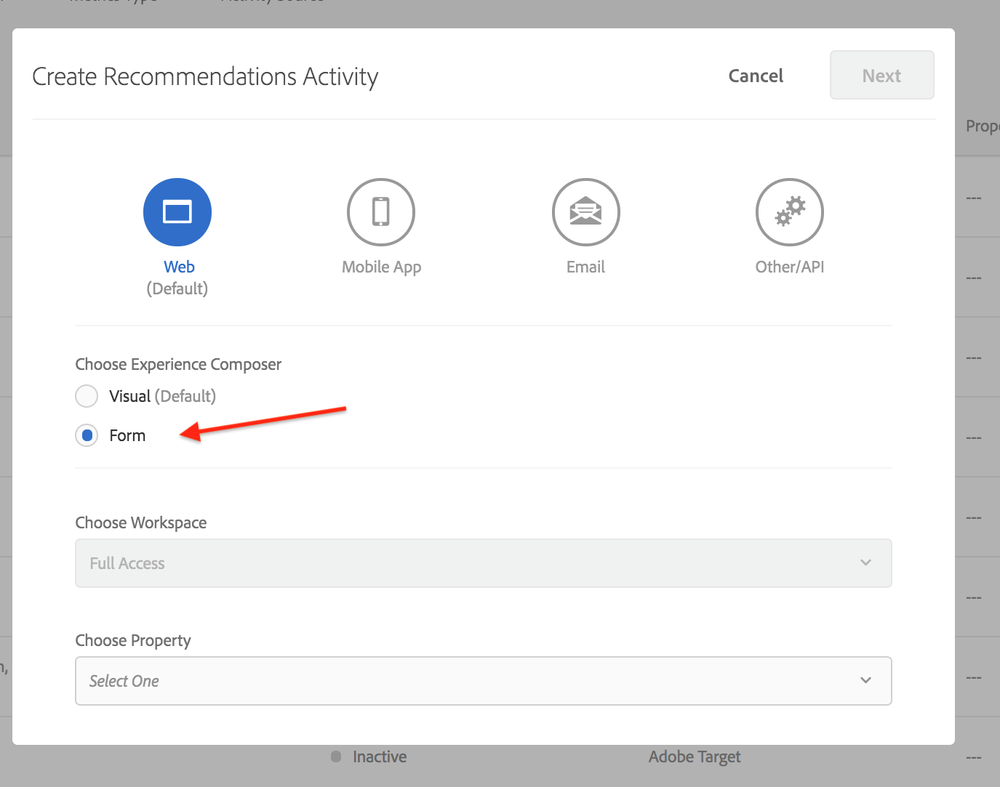
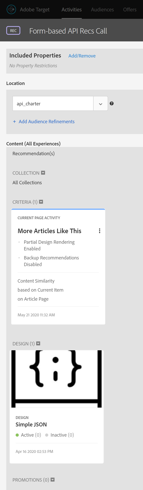

# Hämtar [!DNL Recommendations] med leverans-API

Adobe Target och Adobe Target [!DNL Recommendations] API:er kan användas för att leverera svar på webbsidor, men kan också användas i upplevelser som inte är baserade på HTML, som appar, skärmar, konsoler, e-post, kioskdatorer och andra visningsenheter. Med andra ord, när [!DNL Target] bibliotek och JavaScript inte kan användas, **[!DNL Target]Leverans-API** ger oss fortfarande tillgång till hela [!DNL Target] för att leverera personaliserade upplevelser.

>[!NOTE]
>
> När du begär innehåll som innehåller faktiska rekommendationer (rekommenderade produkter eller objekt) använder du [!DNL Target] Leverans-API.

Om du vill hämta rekommendationer skickar du ett Adobe Target Delivery API POST-anrop med lämplig sammanhangsberoende information, som kan innehålla ett användar-ID (som kan användas med profilspecifika rekommendationer som användarens nyligen visade objekt), relevant mbox-namn, mbox-parametrar, profilparametrar eller andra attribut. Svaret innehåller rekommenderade entity.ids (och kan inkludera andra entitetsdata) i JSON- eller HTML-format, som sedan kan visas i enheten.

The [Leverans-API](https://developer.adobe.com/target/implement/delivery-api/){target=&quot;_blank&quot;} för Adobe Target visar alla befintliga funktioner som en standard [!DNL Target] begäran tillhandahåller.

>[!NOTE]
>Leverans-API:
>* Gör att ni kan hämta upplevelser eller erbjudanden för en plats och en målgrupp på ett RESTful-sätt.
>* Ingen autentisering krävs.
>* Endast POST.
>* Bearbetar inte cookies eller omdirigeringssamtal.
>* Kräver eller känner inte igen&quot;användarroller&quot;. Det hämtar bara innehåll eller rapporterar händelser till [!DNL Target] edge-servrar.

Använda leverans-API för att leverera [!DNL Target] upplevelser - inklusive rekommendationer - följer dessa steg:

1. Skapa en [!DNL Target] aktivitet (A/B, XT, AP eller [!DNL Recommendations]) med den formulärbaserade dispositionen (inte Visual Experience Composer).
2. Använd leverans-API:t för att få ett svar på förfrågningar som genereras av [!DNL Target] aktivitet som du nyss skapade.

<!-- Q: Why are BOTH steps necessary for this? If you have a Form-based recommendation defined for an mbox, what's the point/benefit of ALSO having the Delivery API step in to retrieve results? Why can't you just have the Form-based Rec deliver the results in the destination device...?? A: See use case below... it's when you want to "intercept" the pending results in order to do more stuff prior to displaying the results. Things like real-time comparisons to inventory levels. -->

## Skapa en rekommendation med den formulärbaserade Experience Composer

Om du vill skapa rekommendationer som kan användas med leverans-API:t använder du [Formulärbaserad disposition](https://experienceleague.adobe.com/docs/target/using/experiences/form-experience-composer.html?lang=en).

1. Först skapar och sparar du en JSON-baserad design som du kan använda i dina rekommendationer. Exempel-JSON, plus bakgrundsinformation om hur JSON-svar kan returneras när en formulärbaserad aktivitet konfigureras, finns i dokumentationen för [Skapa rekommendationsdesigner](https://experienceleague.adobe.com/docs/target/using/recommendations/recommendations-design/create-design.html?lang=en). I det här exemplet heter designen *Enkel JSON.*

   

2. I [!DNL Target], navigera till **[!UICONTROL Activities]> [!UICONTROL Create Activity] >[!UICONTROL Recommendations]** väljer **[!UICONTROL Form]**.

   

3. Markera en egenskap och klicka på **[!UICONTROL Next]**.
4. Definiera den plats där du vill att användarna ska få rekommendationens svar. I exemplet nedan används en plats med namnet *api_charter*. Välj din JSON-baserade design, skapad tidigare, namngiven *Enkel JSON.*
   
5. Spara och aktivera rekommendationen. Det kommer att generera resultat. [När resultaten är klara](https://experienceleague.adobe.com/docs/target/using/recommendations/recommendations-activity/previewing-and-launching-your-recommendations-activity.html?lang=en)kan du använda leverans-API:t för att hämta dem.

## Använda leverans-API

Syntaxen för [Leverans-API](https://developer.adobe.com/target/implement/delivery-api/#tag/Delivery-API){target=&quot;_blank&quot;} är:

`POST https://{{CLIENT_CODE}}.tt.omtrdc.net/rest/v1/delivery`

1. Observera att klientkoden krävs. Du hittar din klientkod i Adobe Target genom att navigera till **[!UICONTROL Recommendations]>[!UICONTROL Settings]**. Anteckna **[!UICONTROL Client Code]** värdet i **[!UICONTROL Recommendation API Token]** -avsnitt.
   
1. När du har fått din klientkod konstruerar du ett leverans-API-anrop. Exemplet nedan börjar med **[!UICONTROL Web Batched Mboxes Delivery API Call]** i [Postman-samling för leverans](https://developers.adobetarget.com/api/delivery-api/#section/Getting-Started/Postman-Collection), och gör relevanta ändringar. Exempel:
   * den **webbläsare** och **adress** objekten togs bort från **Brödtext**, eftersom de inte krävs för andra ändamål än HTML
   * *api_charter* anges som platsnamn i det här exemplet
   * entity.id anges eftersom den här rekommendationen baseras på innehållets likhet, vilket kräver att en aktuell artikelnyckel skickas till [!DNL Target].
      
Kom ihåg att konfigurera frågeparametrarna korrekt. Se till att du anger 
`{{CLIENT_CODE}}` vid behov. <!--Q: In the updated call syntax, entity.id is listed as a profileParameter instead of an mboxParameter as in older versions. --> <!--Q: Old image  Old accompanying text: "Note this recommendation is based on Content Similar products based on the entity.id sent via mboxParameters." -->
      
1. Skicka begäran. Detta körs mot *api_charter* plats, som har en aktiv rekommendation som körs på den, definierad med din JSON-design som kommer att visa en lista över rekommenderade enheter.
1. Få ett svar baserat på JSON-designen.
   
Svaret innehåller nyckel-ID samt enhets-ID för de rekommenderade entiteterna.

Använda leverans-API med [!DNL Recommendations] på så sätt kan du utföra ytterligare steg innan du visar rekommendationer till besökaren på en annan enhet än HTML. Du kan till exempel ta svaret från leverans-API:t för att utföra en ytterligare sökning i realtid av information om entitetsattribut (lager, pris, klassificering och så vidare) från ett annat system (till exempel en CMS-, PIM- eller e-handelsplattform) innan du visar det slutliga resultatet.

Med den metod som beskrivs i den här självstudiekursen kan du få vilket program som helst att utnyttja svaret från [!DNL Target] för att ge personaliserade rekommendationer!

## Exempelimplementeringar

Följande resurser innehåller exempel på olika icke-HTML-inriktade implementeringar. Tänk på att varje implementering blir unik på grund av det system och de enheter som används.

| Resurs | Detaljer |
| --- | --- |
| [Adobe Target Everywhere - Implementera serversidan eller i IoT](https://expleague.azureedge.net/labs/L733/index.html) | Adobe Summit 2019 Lab som ger dig en praktisk upplevelse av ett React-program som använder Adobe Target serversides-API:er. |
| [Adobe Target i en mobilapp utan Adobe SDK](https://community.tealiumiq.com/t5/Universal-Data-Hub/Adobe-Target-in-a-Mobile-App-Without-the-Adobe-SDK/ta-p/26753) | Den här guiden visar hur du konfigurerar Adobe Target i din mobilapp utan att installera Adobe SDK. Den här lösningen använder Tealium SDK-webbvyn och Remote Commands-modulen för att skicka och ta emot begäranden till Adobe Visitor API (Experience Cloud) och Adobe Target API. |
| [Så här fungerar Adobe Target i mobilappar](https://experienceleague.adobe.com/docs/target/using/implement-target/mobile-apps/mobile-how-target-works-mobile-apps.html?lang=en) | Hur [!DNL Target] fungerar med Mobile SDK |
| [Konfigurera [!DNL Target] utvidgning i Experience Platform Launch och genomförande [!DNL Target] API:er](https://aep-sdks.gitbook.io/docs/using-mobile-extensions/adobe-target) | Steg för konfiguration av [!DNL Target] tillägg i Experience Platform Launch, lägga till [!DNL Target] Tillägg till appen och implementering [!DNL Target] API:er för att begära aktiviteter, förhämta erbjudanden och ange visuellt förhandsgranskningsläge. |
| [Adobe Target Node Client](https://www.npmjs.com/package/@adobe/target-nodejs-sdk) | Open-sourced [!DNL Target] Node.js SDK v1.0 |
| [Översikt över serversidan](https://experienceleague.adobe.com/docs/target/using/implement-target/server-side/api-and-sdk-overview.html?lang=en) | Information om Adobe Target Server Side delivery APIs, Server Side Batch Delivery APIs, Node.js SDK och Adobe Target [!DNL Recommendations] API:er. |
| [Adobe Campaign Content Recommendations in Email](https://medium.com/adobetech/adobe-campaign-content-recommendations-in-email-b51ced771d7f) | Blogg som beskriver hur du kan utnyttja innehållsrekommendationer i e-post via Adobe Target och Adobe I/O Runtime i Adobe Campaign. |

## Hantera [!DNL Recommendations] Konfigurera med API:er

Rekommendationer konfigureras oftast i Adobe Target-gränssnittet och används eller nås via [!DNL Target] API:er, av skäl som de som nämns i avsnitten ovan. Denna API-samordning är vanlig. Ibland kanske användare vill utföra alla åtgärder via API:er, både konfiguration och användning av resultat. Även om det är mycket mindre vanligt att användare konfigurerar, kör, *och* utnyttja resultatet av rekommendationerna helt med API:erna.

Vi lärde oss [tidigare avsnitt](https://developer.adobe.com/target/before-administer/recs-api/manage-catalog/){target=&quot;_blank&quot;} hur du hanterar Adobe Target Recommendations-enheter och levererar dem på serversidan. På samma sätt kan du i Adobe I/O hantera villkor, kampanjer, samlingar och designmallar utan att behöva logga in på Adobe Target. En fullständig lista över alla [!DNL Recommendations] API:er kan hittas [här](https://developers.adobetarget.com/api/recommendations/), men här är en sammanfattning som du kan referera till.

| Resurs | Detaljer |
| --- | --- |
| [Samlingar](https://developers.adobetarget.com/api/recommendations/#tag/Collections) | Visa, skapa, hämta, redigera och ta bort samlingar. |
| [Kriterier](https://developers.adobetarget.com/api/recommendations/#tag/Criteria) | Lista och hämta villkor. |
| [Designs](https://developers.adobetarget.com/api/recommendations/#tag/Designs) | Lista, skapa, hämta, redigera, ta bort och validera designer. |
| [Enheter](https://developers.adobetarget.com/api/recommendations/#tag/Entities) | Spara, ta bort och hämta enheter. |
| [Erbjudanden](https://developers.adobetarget.com/api/recommendations/#tag/Promotions) | Visa, skapa, hämta, redigera och ta bort kampanjer. |
| [Kategorivillkor](https://developers.adobetarget.com/api/recommendations/#tag/Category-Criteria) | Visa, skapa, hämta, redigera och ta bort kategorivillkor. |
| [Anpassade villkor](https://developers.adobetarget.com/api/recommendations/#tag/Custom-Criteria) | Visa, skapa, hämta, redigera och ta bort anpassade villkor. |
| [Artikelvillkor](https://developers.adobetarget.com/api/recommendations/#tag/Item-Criteria) | Visa, skapa, hämta, redigera och ta bort objektvillkor. |
| [Popularitetskriterier](https://developers.adobetarget.com/api/recommendations/#tag/Popularity-Criteria) | Visa, skapa, hämta, redigera och ta bort popularitetskriterier. |
| [Kriterier för profilattribut](https://developers.adobetarget.com/api/recommendations/#tag/Profile-Attribute-Criteria) | Visa, skapa, hämta, redigera och ta bort villkor för profilattribut. |
| [Senaste villkor](https://developers.adobetarget.com/api/recommendations/#tag/Recent-Criteria) | Lista, skapa, hämta, redigera och ta bort senaste villkor. |
| [Sekvensvillkor](https://developers.adobetarget.com/api/recommendations/#tag/Sequence-Criteria) | Visa, skapa, hämta, redigera och ta bort sekvensvillkor. |

## Referensdokumentation

* [API-dokumentation för Adobe Target Admin](https://developer.adobe.com/target/administer/admin-api/){target=&quot;_blank&quot;}
* [Adobe Target Delivery API](https://developer.adobe.com/target/implement/delivery-api/){target=&quot;_blank&quot;}
* [Integrera [!DNL Recommendations] med e-post](https://experienceleague.adobe.com/docs/target/using/recommendations/recommendations-faq/integrating-recs-email.html)

## Sammanfattning och granskning

Grattis! När du är klar med den här självstudiekursen har du lärt dig att:
* [Hantera katalogen med Recommendations API](https://developer.adobe.com/target/before-administer/recs-api/manage-catalog/){target=&quot;_blank&quot;}
* [Hantera anpassade villkor med Recommendations API](https://developer.adobe.com/target/before-administer/recs-api/manage-custom-criteria/){target=&quot;_blank&quot;}
* [Använda leverans-API:t med Recommendations](https://developer.adobe.com/target/before-administer/recs-api/fetch-recs-server-side-delivery-api/){target=&quot;_blank&quot;}
