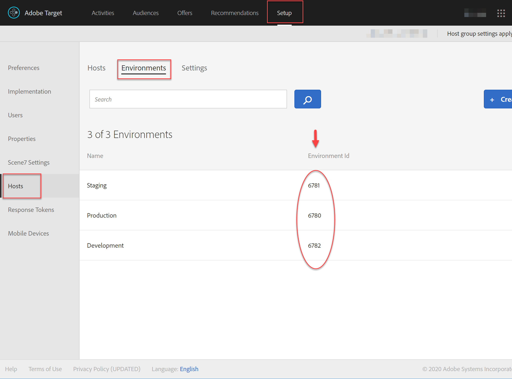
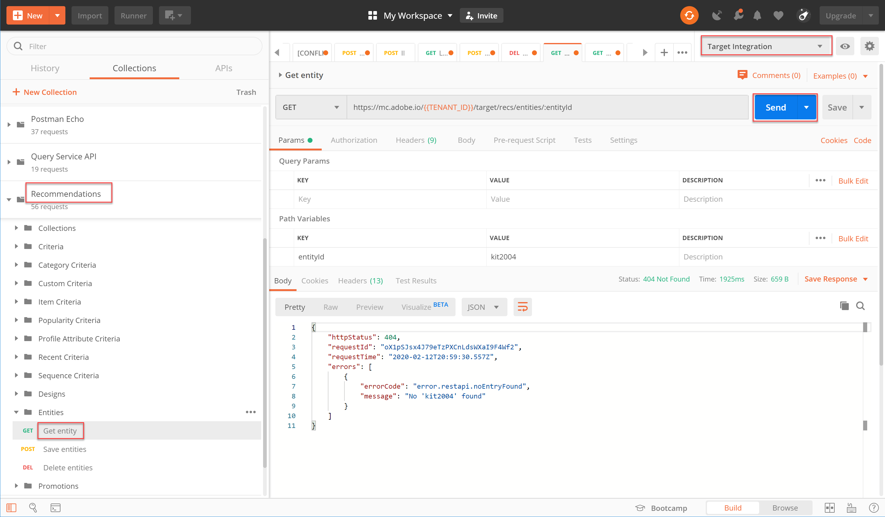

# Hantera din [!DNL Recommendations]-katalog med API:er

Nu har du lärt dig att generera en åtkomsttoken med JWT-autentiseringsflödet för att använda Adobe Target Admin API:er med Adobe I/O.

Du kan använda [Recommendations API:er](https://developers.adobetarget.com/api/recommendations/) för att lägga till, uppdatera eller ta bort objekt i din rekommendationskatalog. Precis som med övriga API:er för Adobe Target Admin kräver API:erna för [!DNL Recommendations] autentisering.

>[!TIP]
>
>Skicka **[!UICONTROL IMS: JWT Generate + Auth via User Token]**-begäran när du behöver uppdatera din åtkomsttoken för autentisering, eftersom den upphör att gälla efter 24 timmar. Mer information finns i [Konfigurera Adobe API-autentisering](../apis/configure-io-target-integration.md).


>[!NOTE]
>
>Hämta [Recommendations Postman-samlingen](https://developers.adobetarget.com/api/recommendations/#section/Postman) innan du fortsätter.

## Skapa och uppdatera objekt med API:t för att spara enheter

Använd [API:t för att fylla i din [!DNL Recommendations]-produktdatabas med API:t i stället för en CSV-produktfeed eller [!DNL Target]-begäranden som aktiveras på produktsidor. ](https://developers.adobetarget.com/api/recommendations/#operation/saveEntities) Den här begäran lägger till eller uppdaterar ett objekt i en enskild [!DNL Target]-miljö. Syntaxen är:

```
POST https://mc.adobe.io/{{TENANT_ID}}/target/recs/entities
```

Du kan till exempel använda Spara enheter för att uppdatera artiklar när vissa tröskelvärden har uppnåtts, t.ex. tröskelvärden för lager eller pris, för att flagga dessa artiklar och förhindra att de rekommenderas.

1. Navigera till **[!DNL Target]> [!UICONTROL Setup] > [!UICONTROL Hosts] >[!UICONTROL Environments]** för att få det [!DNL Target] miljö-ID där du vill lägga till eller uppdatera ett objekt.

   

2. Verifiera att `TENANT_ID` och `API_KEY` refererar till Postman-miljövariablerna som etablerats tidigare. Använd bilden nedan för att jämföra. Om det behövs kan du ändra rubrikerna och sökvägen i din API-begäran så att de matchar dem i bilden nedan.

   

3. Ange din JSON som **raw**-kod i **Body**. Glöm inte att ange ditt miljö-ID med variabeln `environment`. (I exemplet nedan är miljö-ID 6781.)

   

   >!![NOTE]
   Nedan visas exempel-JSON som lägger till entity.id kit2001 med associerade enhetsvärden för en Toaster Oven-produkt i miljö 6781.

   ```
      {
      "entities": [{
              "name": "Toaster Oven",
              "id": "kit2001",
              "environment": 6781,
              "categories": [
                  "housewares:appliances"
              ],
              "attributes": {
                  "inventory": 77,
                  "margin": 23,
                  "message": "crashing helicopter",
                  "pageUrl": "www.foobar.foo.com/helicopter.html",
                  "thumbnailUrl": "www.foobar.foo.com/helicopter.jpg",
                  "value": 19.2
              }
          }]
      }
   ```

4. Klicka på **Skicka**. Du bör få följande svar.

   

JSON-objektet kan skalas för att skicka flera produkter. Denna JSON anger till exempel två enheter.

```
    {
        "entities": [{
                "name": "Toaster Oven",
                "id": "kit2001",
                "environment": 6781,
                "categories": [
                    "housewares:appliances"
                ],
                "attributes": {
                    "inventory": 89,
                    "margin": 11,
                    "message": "Toaster Oven",
                    "pageUrl": "www.foobar.foo.com/helicopter.html",
                    "thumbnailUrl": "www.foobar.foo.com/helicopter.jpg",
                    "value": 102.5
                }
            },
            {
                "name": "Blender",
                "id": "kit2002",
                "environment": 6781,
                "categories": [
                    "housewares:appliances"
                ],
                "attributes": {
                    "inventory": 36,
                    "margin": 5,
                    "message": "Blender",
                    "pageUrl": "www.foobar.foo.com/helicopter.html",
                    "thumbnailUrl": "www.foobar.foo.com/helicopter.jpg",
                    "value": 54.5
                }
            }
        ]
    }
```

1. Nu är det din tur! Använd API:t **Spara entiteter** för att lägga till följande objekt i katalogen. Använd JSON-exempelkoden ovan som utgångspunkt. (Du måste utöka JSON för att inkludera ytterligare entiteter.)

   

De sista två objekten hör inte hemma. Låt oss undersöka dem med API:t **Hämta entitet** och, om det behövs, ta bort dem med API:t **Ta bort entiteter**.

## Hämta objektinformation med Get Entity API

Om du vill hämta information om ett befintligt objekt använder du [Hämta enhets-API](https://developers.adobetarget.com/api/recommendations/#operation/getEntity). Syntaxen är:

```
GET https://mc.adobe.io/{{TENANT_ID}}/target/recs/entities/[entity.id]
```

Enhetsinformation kan bara hämtas för en enskild entitet åt gången. Du kan använda Hämta entitet för att bekräfta att uppdateringar har gjorts i katalogen som förväntat, eller för att på annat sätt granska innehållet i katalogen.

1. Ange enhets-ID i API-begäran med variabeln `entityId`. Följande exempel returnerar information för den entitet vars entityId=kit2004.

   

2. Verifiera att `TENANT_ID` och `API_KEY` refererar till Postman-miljövariablerna som etablerats tidigare. Använd bilden nedan för att jämföra. Om det behövs kan du ändra rubrikerna och sökvägen i din API-begäran så att de matchar dem i bilden nedan.

   

3. Skicka begäran.

   
Om du får ett felmeddelande om att enheten inte hittades, som visas i exemplet ovan, kontrollerar du att du skickar begäran till rätt  [!DNL Target] miljö.

   >[!NOTE]
   Om ingen miljö uttryckligen anges försöker Get Entity att hämta entiteten från din [standardmiljö](https://experienceleague.adobe.com/docs/target/using/administer/hosts.html?lang=en). Om du vill hämta från någon annan miljö än standardmiljön måste du ange miljö-ID:t.

4. Om det behövs lägger du till parametern `environmentId` och skickar begäran igen.

   

5. Skicka ytterligare en **Get Entity**-begäran, den här gången för att inspektera entiteten vars entityId=kit2005.

   

Anta att du måste ta bort dessa enheter från katalogen. Låt oss använda API:t **Ta bort entiteter**.

## Ta bort objekt med API:t Ta bort entiteter

Om du vill ta bort objekt från katalogen använder du [API:t Ta bort entiteter](https://developers.adobetarget.com/api/recommendations/#operation/deleteEntities). Syntaxen är:

```
DELETE https://mc.adobe.io/{{TENANT_ID}}/target/recs/entities?ids=[comma-delimited-entity-ids]&environment=[environmentId]
```

>[!WARNING]
Detta API tar bort entiteter som refereras av de ID som du anger.
Om inga enhets-ID anges tas alla enheter i den angivna miljön bort. Om inget miljö-ID anges tas enheter bort från alla miljöer. Använd detta med försiktighet!

1. Navigera till **[!DNL Target]> [!UICONTROL Setup] > [!UICONTROL Hosts] >[!UICONTROL Environments]** för att hämta det [!DNL Target] miljö-ID som du vill ta bort objekt från.

   

2. I API-begäran anger du enhets-ID för de entiteter som du vill ta bort med syntaxen `&ids=[comma-delimited-entity-ids]` (en frågeparameter). Om du tar bort mer än en enhet avgränsar du ID:n med kommatecken.

   

3. Ange miljö-ID med syntaxen `&environment=[environmentId]`, annars tas enheter i alla miljöer bort.

   

4. Verifiera att `TENANT_ID` och `API_KEY` refererar till Postman-miljövariablerna som etablerats tidigare. Använd bilden nedan för att jämföra. Om det behövs kan du ändra rubrikerna och sökvägen i din API-begäran så att de matchar dem i bilden nedan.

   

5. Skicka begäran.

   

6. Verifiera dina resultat med **Get Entity**, som nu bör ange att det inte går att hitta de borttagna entiteterna.

   

   

Grattis! Du kan nu använda API:erna för [!DNL Recommendations] för att skapa, uppdatera, ta bort och få information om entiteterna i din katalog. I nästa avsnitt får du lära dig hur du hanterar anpassade villkor.

[Nästa Hantera anpassade villkor >](manage-custom-criteria.md)
