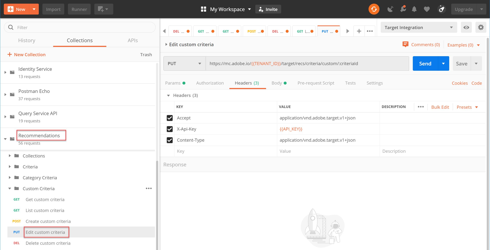
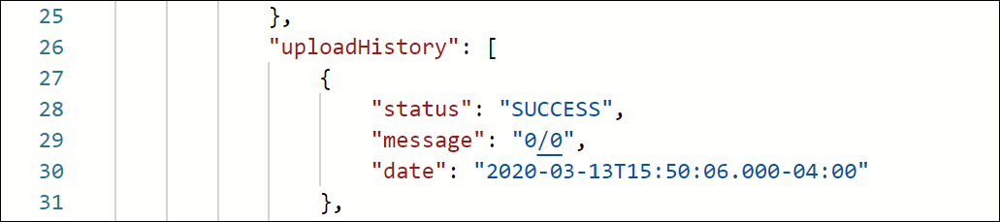

# Hantera anpassade villkor

Ibland kan algoritmerna som tillhandahålls av [!DNL Recommendations] inte visa vissa objekt som du vill befordra. I sådana fall kan du med anpassade kriterier leverera en specifik uppsättning rekommenderade objekt för ett visst nyckelobjekt eller en viss kategori. Du definierar mappningen mellan nyckelobjektet eller kategorin och de rekommenderade objekten och importerar mappningen som ett anpassat villkor. Den här processen beskrivs i [dokumentationen för anpassade villkor](https://docs.adobe.com/content/help/en/target/using/recommendations/criteria/recommendations-csv.html). Som du kan se i den dokumentationen kan du skapa, redigera och ta bort anpassade villkor via användargränssnittet i [!DNL Target]. [!DNL Target] innehåller dock även en uppsättning API:er för anpassade kriterier som ger en mer detaljerad hantering av anpassade villkor.

>[!IMPORTANT]
>
>Följ den här användarhandboken för anpassade villkor:
>
> Gör antingen allt (skapa, redigera, ta bort) för ett visst anpassat villkor med API:erna, eller gör allt (skapa, redigera, ta bort) med gränssnittet. Om du hanterar anpassade villkor med en kombination av användargränssnittet och API:t kan det leda till att information eller oväntade resultat hamnar i konflikt. Om du till exempel skapar ett anpassat villkor i användargränssnittet, men sedan redigerar det via API, återspeglas inte dina uppdateringar i användargränssnittet, även om det uppdateras i serverdelen, vilket visas via API:t.

## Skapa anpassade villkor

Om du vill skapa anpassade villkor med hjälp av [API:t för att skapa anpassade kriterier är syntaxen:](https://developers.adobetarget.com/api/recommendations/#operation/createCriteriaCustom)

`POST https://mc.adobe.io/{{TENANT_ID}}/target/recs/criteria/custom`

>[!WARNING]
>
>Anpassade villkor som skapats med API:t Skapa anpassade kriterier, som beskrivs i den här övningen, visas i användargränssnittet där de finns kvar. Du kan inte redigera eller ta bort dem från användargränssnittet. Du kan redigera eller ta bort dem **via API**, men på båda sätten visas de fortfarande i användargränssnittet för [!DNL Target]. Om du vill behålla möjligheten att redigera eller ta bort från användargränssnittet skapar du anpassade villkor med användargränssnittet per [dokumentationen](https://docs.adobe.com/content/help/en/target/using/recommendations/criteria/recommendations-csv.html), i stället för att använda API:t Skapa anpassade kriterier.

Fortsätt bara med den här självstudiekursen när du har läst varningen ovan och är bekväm med att skapa nya anpassade villkor som inte kan tas bort från användargränssnittet.

1. Verifiera `TENANT_ID` och `API_KEY` för **Skapa anpassade villkor** referera till Postman-miljövariablerna som etablerats tidigare. Använd bilden nedan för att jämföra.

   

2. Lägg till din **Body** som **rå** JSON som definierar platsen för din CSV-fil för anpassade kriterier. Använd exemplet i [Skapa API:t för anpassade kriterier](https://developers.adobetarget.com/api/recommendations/#operation/getAllCriteriaCustom) som en mall och ange dina `environmentId`-värden och andra värden efter behov. I det här exemplet använder vi LAST_PURCHASED som nyckel.

   

3. Skicka förfrågan och observera svaret, som innehåller information om de anpassade villkor du just skapade.

   

4. Om du vill verifiera att dina anpassade villkor har skapats går du till **[!UICONTROL Recommendations]>[!UICONTROL Criteria]** och söker efter villkoren efter namn. Du kan också använda **API för att lista anpassade kriterier** i nästa steg.

   

I det här fallet har vi ett fel. Låt oss undersöka felet närmare genom att undersöka de anpassade villkoren med **API:t för att lista anpassade kriterier**.

## Lista anpassade villkor

Om du vill hämta en lista över alla anpassade villkor tillsammans med information för varje, använder du [API för att lista anpassade kriterier](https://developers.adobetarget.com/api/recommendations/#operation/getAllCriteriaCustom). Syntaxen är:

`GET https://mc.adobe.io/{{TENANT_ID}}/target/recs/criteria/custom`

1. Verifiera `TENANT_ID` och `API_KEY` som tidigare och skicka begäran. Observera det anpassade villkors-ID:t i svaret, liksom information om felmeddelandet som nämndes tidigare.
   

I det här fallet inträffade felet eftersom serverinformationen är felaktig, vilket innebär att [!DNL Target] inte kan komma åt CSV-filen som innehåller den anpassade villkorsdefinitionen. Låt oss redigera de anpassade villkoren för att korrigera detta.

## Redigera anpassade villkor

Om du vill ändra informationen för en anpassad villkorsdefinition använder du [API:t Redigera anpassade kriterier](https://developers.adobetarget.com/api/recommendations/#operation/updateCriteriaCustom). Syntaxen är:

`POST https://mc.adobe.io/{{TENANT_ID}}/target/recs/criteria/custom/:criteriaId`

1. Kontrollera `TENANT_ID` och `API_KEY` som tidigare.
   

1. Ange villkor-ID för det (enkla) anpassade villkor som du vill redigera.
   

1. I Body anger du uppdaterad JSON med rätt serverinformation. (I det här steget anger du FTP-åtkomst till en server som du har åtkomst till.)
   

1. Skicka förfrågan och notera svaret.
   

Låt oss kontrollera om de uppdaterade anpassade villkoren lyckades med hjälp av **API:t Hämta anpassade kriterier**.

## Hämta anpassade villkor

Om du vill visa information om anpassade villkor för ett specifikt anpassat villkor använder du [API:t Hämta anpassade kriterier](https://developers.adobetarget.com/api/recommendations/#operation/getCriteriaCustom). Syntaxen är:

`GET https://mc.adobe.io/{{TENANT_ID}}/target/recs/criteria/custom/:criteriaId`

1. Ange villkor-ID för de anpassade villkor vars information du vill få. Skicka förfrågan och granska svaret.
   
1. Bekräfta att åtgärden lyckades. (Kontrollera i vårt fall att det inte finns några ytterligare FTP-fel.)
   
1. (Valfritt) Kontrollera att uppdateringen visas korrekt i användargränssnittet.
   

## Ta bort anpassade villkor

Ta bort anpassade villkor med hjälp av det kriterier-ID som beskrivs ovan med hjälp av [API:t Ta bort anpassade kriterier](https://developers.adobetarget.com/api/recommendations/#operation/deleteCriteriaCustom). Syntaxen är:

`DELETE https://mc.adobe.io/{{TENANT_ID}}/target/recs/criteria/custom/:criteriaId`

1. Ange kriterier-ID:t för det (enkla) anpassade villkor som du vill ta bort. Klicka på **Skicka**.
   

1. Kontrollera att villkoren har tagits bort med Hämta anpassade villkor.
   
I det här fallet anger det förväntade 404-felet att det inte går att hitta de borttagna villkoren.

>[!NOTE]
>Som en påminnelse kommer villkoren inte att tas bort från [!DNL Target]-gränssnittet även om det togs bort, eftersom det skapades med API:t Skapa anpassade kriterier.

Grattis! Du kan nu skapa, lista, redigera, ta bort och få information om anpassade villkor med hjälp av API:t [!DNL Recommendations]. I nästa avsnitt använder du leverans-API:t [!DNL Target] för att hämta rekommendationer.

[Nästa&quot;Hämta Recommendations med leverans-API:t på serversidan&quot; >](fetch-recs-server-side-delivery-api.md)
